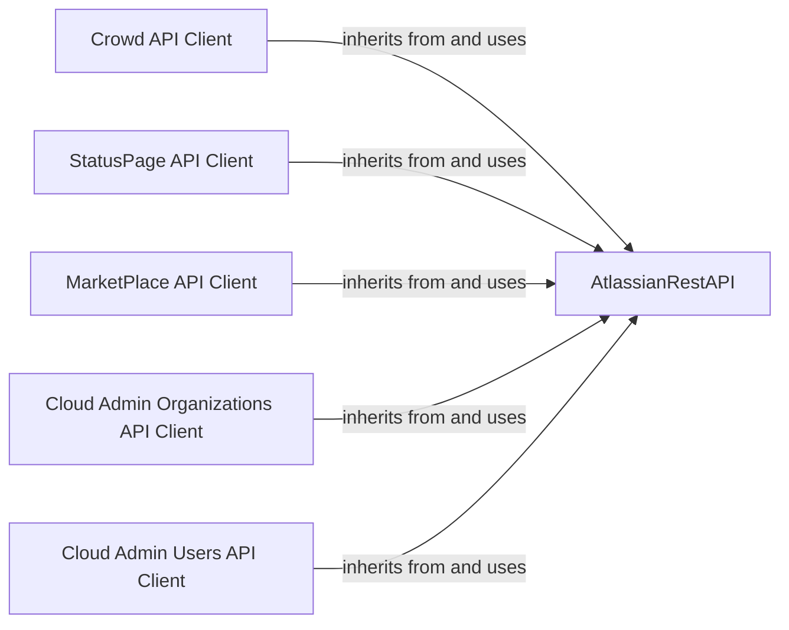

## Component Details

This graph illustrates the structure and interactions within the Atlassian Platform & Marketplace Clients subsystem. The core component, `AtlassianRestAPI`, provides the fundamental HTTP communication and authentication mechanisms. All other client components, including `Crowd API Client`, `StatusPage API Client`, `MarketPlace API Client`, `Cloud Admin Organizations API Client`, and `Cloud Admin Users API Client`, inherit from and utilize the `AtlassianRestAPI` to interact with their respective Atlassian services. This design promotes reusability of network and authentication logic, allowing each client to focus on the specific API endpoints and data models of its domain (Crowd for user/group management, StatusPage for public status updates, Marketplace for application information, and Cloud Admin for organization and user profile management).

### AtlassianRestAPI
This is the foundational component for all Atlassian API interactions. It manages HTTP sessions, various authentication methods (basic, token, OAuth1, OAuth2, Kerberos, header), SSL verification, proxy settings, and implements robust retry mechanisms for handling transient network or API rate limit issues. It provides a standardized interface for performing GET, POST, PUT, PATCH, and DELETE operations against Atlassian services.

**Related Classes/Methods**:

- <a href="https://github.com/atlassian-api/atlassian-python-api/blob/master/atlassian/rest_client.py#L43-L1001" target="_blank" rel="noopener noreferrer">`atlassian.rest_client.AtlassianRestAPI` (43:1001)</a>
- <a href="https://github.com/atlassian-api/atlassian-python-api/blob/master/atlassian/rest_client.py#L72-L202" target="_blank" rel="noopener noreferrer">`atlassian.rest_client.AtlassianRestAPI.__init__` (72:202)</a>
- <a href="https://github.com/atlassian-api/atlassian-python-api/blob/master/atlassian/rest_client.py#L207-L208" target="_blank" rel="noopener noreferrer">`atlassian.rest_client.AtlassianRestAPI.__exit__` (207:208)</a>
- <a href="https://github.com/atlassian-api/atlassian-python-api/blob/master/atlassian/rest_client.py#L210-L211" target="_blank" rel="noopener noreferrer">`atlassian.rest_client.AtlassianRestAPI._create_basic_session` (210:211)</a>
- <a href="https://github.com/atlassian-api/atlassian-python-api/blob/master/atlassian/rest_client.py#L213-L214" target="_blank" rel="noopener noreferrer">`atlassian.rest_client.AtlassianRestAPI._create_token_session` (213:214)</a>
- <a href="https://github.com/atlassian-api/atlassian-python-api/blob/master/atlassian/rest_client.py#L224-L232" target="_blank" rel="noopener noreferrer">`atlassian.rest_client.AtlassianRestAPI._create_oauth_session` (224:232)</a>
- <a href="https://github.com/atlassian-api/atlassian-python-api/blob/master/atlassian/rest_client.py#L234-L245" target="_blank" rel="noopener noreferrer">`atlassian.rest_client.AtlassianRestAPI._create_oauth2_session` (234:245)</a>
- <a href="https://github.com/atlassian-api/atlassian-python-api/blob/master/atlassian/rest_client.py#L219-L222" target="_blank" rel="noopener noreferrer">`atlassian.rest_client.AtlassianRestAPI._create_kerberos_session` (219:222)</a>
- <a href="https://github.com/atlassian-api/atlassian-python-api/blob/master/atlassian/rest_client.py#L216-L217" target="_blank" rel="noopener noreferrer">`atlassian.rest_client.AtlassianRestAPI._create_header_session` (216:217)</a>
- <a href="https://github.com/atlassian-api/atlassian-python-api/blob/master/atlassian/rest_client.py#L247-L254" target="_blank" rel="noopener noreferrer">`atlassian.rest_client.AtlassianRestAPI._update_header` (247:254)</a>
- <a href="https://github.com/atlassian-api/atlassian-python-api/blob/master/atlassian/rest_client.py#L257-L265" target="_blank" rel="noopener noreferrer">`atlassian.rest_client.AtlassianRestAPI._response_handler` (257:265)</a>
- <a href="https://github.com/atlassian-api/atlassian-python-api/blob/master/atlassian/rest_client.py#L267-L286" target="_blank" rel="noopener noreferrer">`atlassian.rest_client.AtlassianRestAPI._calculate_backoff_value` (267:286)</a>
- <a href="https://github.com/atlassian-api/atlassian-python-api/blob/master/atlassian/rest_client.py#L288-L318" target="_blank" rel="noopener noreferrer">`atlassian.rest_client.AtlassianRestAPI._retry_handler` (288:318)</a>
- <a href="https://github.com/atlassian-api/atlassian-python-api/blob/master/atlassian/rest_client.py#L320-L344" target="_blank" rel="noopener noreferrer">`atlassian.rest_client.AtlassianRestAPI.log_curl_debug` (320:344)</a>
- <a href="https://github.com/atlassian-api/atlassian-python-api/blob/master/atlassian/rest_client.py#L346-L353" target="_blank" rel="noopener noreferrer">`atlassian.rest_client.AtlassianRestAPI.resource_url` (346:353)</a>
- <a href="https://github.com/atlassian-api/atlassian-python-api/blob/master/atlassian/rest_client.py#L356-L360" target="_blank" rel="noopener noreferrer">`atlassian.rest_client.AtlassianRestAPI.url_joiner` (356:360)</a>
- <a href="https://github.com/atlassian-api/atlassian-python-api/blob/master/atlassian/rest_client.py#L362-L363" target="_blank" rel="noopener noreferrer">`atlassian.rest_client.AtlassianRestAPI.close` (362:363)</a>
- <a href="https://github.com/atlassian-api/atlassian-python-api/blob/master/atlassian/rest_client.py#L365-L446" target="_blank" rel="noopener noreferrer">`atlassian.rest_client.AtlassianRestAPI.request` (365:446)</a>
- <a href="https://github.com/atlassian-api/atlassian-python-api/blob/master/atlassian/rest_client.py#L450-L463" target="_blank" rel="noopener noreferrer">`atlassian.rest_client.AtlassianRestAPI.get` (450:463)</a>
- <a href="https://github.com/atlassian-api/atlassian-python-api/blob/master/atlassian/rest_client.py#L580-L606" target="_blank" rel="noopener noreferrer">`atlassian.rest_client.AtlassianRestAPI._get_response_content` (580:606)</a>
- <a href="https://github.com/atlassian-api/atlassian-python-api/blob/master/atlassian/rest_client.py#L610-L623" target="_blank" rel="noopener noreferrer">`atlassian.rest_client.AtlassianRestAPI.post` (610:623)</a>
- <a href="https://github.com/atlassian-api/atlassian-python-api/blob/master/atlassian/rest_client.py#L731-L743" target="_blank" rel="noopener noreferrer">`atlassian.rest_client.AtlassianRestAPI.put` (731:743)</a>
- <a href="https://github.com/atlassian-api/atlassian-python-api/blob/master/atlassian/rest_client.py#L832-L867" target="_blank" rel="noopener noreferrer">`atlassian.rest_client.AtlassianRestAPI.patch` (832:867)</a>
- <a href="https://github.com/atlassian-api/atlassian-python-api/blob/master/atlassian/rest_client.py#L871-L882" target="_blank" rel="noopener noreferrer">`atlassian.rest_client.AtlassianRestAPI.delete` (871:882)</a>
- <a href="https://github.com/atlassian-api/atlassian-python-api/blob/master/atlassian/rest_client.py#L964-L996" target="_blank" rel="noopener noreferrer">`atlassian.rest_client.AtlassianRestAPI.raise_for_status` (964:996)</a>
- <a href="https://github.com/atlassian-api/atlassian-python-api/blob/master/atlassian/rest_client.py#L999-L1001" target="_blank" rel="noopener noreferrer">`atlassian.rest_client.AtlassianRestAPI.session` (999:1001)</a>

### Crowd API Client
This component provides a high-level interface for interacting with the Atlassian Crowd API. It encapsulates functionalities for managing users (e.g., creation, activation, deactivation, deletion, retrieving user details and group memberships) and groups (e.g., adding users to groups, creating new groups, retrieving group members). Additionally, it offers methods for checking plugin health and managing plugin licenses within Crowd.

**Related Classes/Methods**:

- <a href="https://github.com/atlassian-api/atlassian-python-api/blob/master/atlassian/crowd.py#L12-L297" target="_blank" rel="noopener noreferrer">`atlassian.crowd.Crowd` (12:297)</a>
- <a href="https://github.com/atlassian-api/atlassian-python-api/blob/master/atlassian/crowd.py#L17-L26" target="_blank" rel="noopener noreferrer">`atlassian.crowd.Crowd.__init__` (17:26)</a>
- <a href="https://github.com/atlassian-api/atlassian-python-api/blob/master/atlassian/crowd.py#L28-L29" target="_blank" rel="noopener noreferrer">`atlassian.crowd.Crowd._crowd_api_url` (28:29)</a>
- <a href="https://github.com/atlassian-api/atlassian-python-api/blob/master/atlassian/crowd.py#L31-L56" target="_blank" rel="noopener noreferrer">`atlassian.crowd.Crowd._user_change_status` (31:56)</a>
- <a href="https://github.com/atlassian-api/atlassian-python-api/blob/master/atlassian/crowd.py#L58-L65" target="_blank" rel="noopener noreferrer">`atlassian.crowd.Crowd.user` (58:65)</a>
- <a href="https://github.com/atlassian-api/atlassian-python-api/blob/master/atlassian/crowd.py#L67-L73" target="_blank" rel="noopener noreferrer">`atlassian.crowd.Crowd.user_activate` (67:73)</a>
- <a href="https://github.com/atlassian-api/atlassian-python-api/blob/master/atlassian/crowd.py#L75-L108" target="_blank" rel="noopener noreferrer">`atlassian.crowd.Crowd.user_create` (75:108)</a>
- <a href="https://github.com/atlassian-api/atlassian-python-api/blob/master/atlassian/crowd.py#L110-L117" target="_blank" rel="noopener noreferrer">`atlassian.crowd.Crowd.user_deactivate` (110:117)</a>
- <a href="https://github.com/atlassian-api/atlassian-python-api/blob/master/atlassian/crowd.py#L119-L128" target="_blank" rel="noopener noreferrer">`atlassian.crowd.Crowd.user_delete` (119:128)</a>
- <a href="https://github.com/atlassian-api/atlassian-python-api/blob/master/atlassian/crowd.py#L130-L139" target="_blank" rel="noopener noreferrer">`atlassian.crowd.Crowd.user_groups` (130:139)</a>
- <a href="https://github.com/atlassian-api/atlassian-python-api/blob/master/atlassian/crowd.py#L141-L152" target="_blank" rel="noopener noreferrer">`atlassian.crowd.Crowd.group_members` (141:152)</a>
- <a href="https://github.com/atlassian-api/atlassian-python-api/blob/master/atlassian/crowd.py#L154-L165" target="_blank" rel="noopener noreferrer">`atlassian.crowd.Crowd.is_user_in_group` (154:165)</a>
- <a href="https://github.com/atlassian-api/atlassian-python-api/blob/master/atlassian/crowd.py#L167-L181" target="_blank" rel="noopener noreferrer">`atlassian.crowd.Crowd.group_add_user` (167:181)</a>
- <a href="https://github.com/atlassian-api/atlassian-python-api/blob/master/atlassian/crowd.py#L183-L194" target="_blank" rel="noopener noreferrer">`atlassian.crowd.Crowd.health_check` (183:194)</a>
- <a href="https://github.com/atlassian-api/atlassian-python-api/blob/master/atlassian/crowd.py#L196-L202" target="_blank" rel="noopener noreferrer">`atlassian.crowd.Crowd.get_plugins_info` (196:202)</a>
- <a href="https://github.com/atlassian-api/atlassian-python-api/blob/master/atlassian/crowd.py#L204-L210" target="_blank" rel="noopener noreferrer">`atlassian.crowd.Crowd.get_plugin_info` (204:210)</a>
- <a href="https://github.com/atlassian-api/atlassian-python-api/blob/master/atlassian/crowd.py#L212-L218" target="_blank" rel="noopener noreferrer">`atlassian.crowd.Crowd.get_plugin_license_info` (212:218)</a>
- <a href="https://github.com/atlassian-api/atlassian-python-api/blob/master/atlassian/crowd.py#L220-L234" target="_blank" rel="noopener noreferrer">`atlassian.crowd.Crowd.upload_plugin` (220:234)</a>
- <a href="https://github.com/atlassian-api/atlassian-python-api/blob/master/atlassian/crowd.py#L236-L243" target="_blank" rel="noopener noreferrer">`atlassian.crowd.Crowd.delete_plugin` (236:243)</a>
- <a href="https://github.com/atlassian-api/atlassian-python-api/blob/master/atlassian/crowd.py#L245-L247" target="_blank" rel="noopener noreferrer">`atlassian.crowd.Crowd.check_plugin_manager_status` (245:247)</a>
- <a href="https://github.com/atlassian-api/atlassian-python-api/blob/master/atlassian/crowd.py#L249-L262" target="_blank" rel="noopener noreferrer">`atlassian.crowd.Crowd.update_plugin_license` (249:262)</a>
- <a href="https://github.com/atlassian-api/atlassian-python-api/blob/master/atlassian/crowd.py#L265-L280" target="_blank" rel="noopener noreferrer">`atlassian.crowd.Crowd.memberships` (265:280)</a>
- <a href="https://github.com/atlassian-api/atlassian-python-api/blob/master/atlassian/crowd.py#L282-L297" target="_blank" rel="noopener noreferrer">`atlassian.crowd.Crowd.group_create` (282:297)</a>

### StatusPage API Client
This component provides a comprehensive set of methods for interacting with the Atlassian Statuspage API. It enables management of pages, organizations, users, embed configurations, subscribers, incidents, postmortems, components, component groups, and metrics, offering functionalities like listing, creating, updating, and deleting these entities.

**Related Classes/Methods**:

- <a href="https://github.com/atlassian-api/atlassian-python-api/blob/master/atlassian/statuspage.py#L108-L3133" target="_blank" rel="noopener noreferrer">`atlassian.statuspage.StatusPage` (108:3133)</a>
- <a href="https://github.com/atlassian-api/atlassian-python-api/blob/master/atlassian/statuspage.py#L111-L112" target="_blank" rel="noopener noreferrer">`atlassian.statuspage.StatusPage.__init__` (111:112)</a>
- <a href="https://github.com/atlassian-api/atlassian-python-api/blob/master/atlassian/statuspage.py#L114-L133" target="_blank" rel="noopener noreferrer">`atlassian.statuspage.StatusPage.page_list_pages` (114:133)</a>
- <a href="https://github.com/atlassian-api/atlassian-python-api/blob/master/atlassian/statuspage.py#L135-L158" target="_blank" rel="noopener noreferrer">`atlassian.statuspage.StatusPage.get_page` (135:158)</a>
- <a href="https://github.com/atlassian-api/atlassian-python-api/blob/master/atlassian/statuspage.py#L160-L190" target="_blank" rel="noopener noreferrer">`atlassian.statuspage.StatusPage.page_update` (160:190)</a>
- <a href="https://github.com/atlassian-api/atlassian-python-api/blob/master/atlassian/statuspage.py#L192-L218" target="_blank" rel="noopener noreferrer">`atlassian.statuspage.StatusPage.organization_get_users` (192:218)</a>
- <a href="https://github.com/atlassian-api/atlassian-python-api/blob/master/atlassian/statuspage.py#L220-L245" target="_blank" rel="noopener noreferrer">`atlassian.statuspage.StatusPage.organization_get_user_permissions` (220:245)</a>
- <a href="https://github.com/atlassian-api/atlassian-python-api/blob/master/atlassian/statuspage.py#L247-L291" target="_blank" rel="noopener noreferrer">`atlassian.statuspage.StatusPage.organization_set_user_permissions` (247:291)</a>
- <a href="https://github.com/atlassian-api/atlassian-python-api/blob/master/atlassian/statuspage.py#L293-L316" target="_blank" rel="noopener noreferrer">`atlassian.statuspage.StatusPage.page_get_embed_config_settings` (293:316)</a>
- <a href="https://github.com/atlassian-api/atlassian-python-api/blob/master/atlassian/statuspage.py#L318-L356" target="_blank" rel="noopener noreferrer">`atlassian.statuspage.StatusPage.page_update_embed_config_settings` (318:356)</a>
- <a href="https://github.com/atlassian-api/atlassian-python-api/blob/master/atlassian/statuspage.py#L358-L387" target="_blank" rel="noopener noreferrer">`atlassian.statuspage.StatusPage.page_access_users_list` (358:387)</a>
- <a href="https://github.com/atlassian-api/atlassian-python-api/blob/master/atlassian/statuspage.py#L389-L414" target="_blank" rel="noopener noreferrer">`atlassian.statuspage.StatusPage.page_get_access_user` (389:414)</a>
- <a href="https://github.com/atlassian-api/atlassian-python-api/blob/master/atlassian/statuspage.py#L416-L453" target="_blank" rel="noopener noreferrer">`atlassian.statuspage.StatusPage.page_set_access_user` (416:453)</a>
- <a href="https://github.com/atlassian-api/atlassian-python-api/blob/master/atlassian/statuspage.py#L455-L481" target="_blank" rel="noopener noreferrer">`atlassian.statuspage.StatusPage.page_delete_access_user` (455:481)</a>
- <a href="https://github.com/atlassian-api/atlassian-python-api/blob/master/atlassian/statuspage.py#L483-L513" target="_blank" rel="noopener noreferrer">`atlassian.statuspage.StatusPage.page_get_components_access_user` (483:513)</a>
- <a href="https://github.com/atlassian-api/atlassian-python-api/blob/master/atlassian/statuspage.py#L515-L543" target="_blank" rel="noopener noreferrer">`atlassian.statuspage.StatusPage.page_add_components_access_user` (515:543)</a>
- <a href="https://github.com/atlassian-api/atlassian-python-api/blob/master/atlassian/statuspage.py#L545-L573" target="_blank" rel="noopener noreferrer">`atlassian.statuspage.StatusPage.page_replace_components_access_user` (545:573)</a>
- <a href="https://github.com/atlassian-api/atlassian-python-api/blob/master/atlassian/statuspage.py#L575-L603" target="_blank" rel="noopener noreferrer">`atlassian.statuspage.StatusPage.page_delete_components_access_user` (575:603)</a>
- <a href="https://github.com/atlassian-api/atlassian-python-api/blob/master/atlassian/statuspage.py#L605-L633" target="_blank" rel="noopener noreferrer">`atlassian.statuspage.StatusPage.page_delete_component_access_user` (605:633)</a>
- <a href="https://github.com/atlassian-api/atlassian-python-api/blob/master/atlassian/statuspage.py#L635-L661" target="_blank" rel="noopener noreferrer">`atlassian.statuspage.StatusPage.page_get_metrics_access_user` (635:661)</a>
- <a href="https://github.com/atlassian-api/atlassian-python-api/blob/master/atlassian/statuspage.py#L663-L691" target="_blank" rel="noopener noreferrer">`atlassian.statuspage.StatusPage.page_add_metrics_access_user` (663:691)</a>
- <a href="https://github.com/atlassian-api/atlassian-python-api/blob/master/atlassian/statuspage.py#L693-L721" target="_blank" rel="noopener noreferrer">`atlassian.statuspage.StatusPage.page_replace_metrics_access_user` (693:721)</a>
- <a href="https://github.com/atlassian-api/atlassian-python-api/blob/master/atlassian/statuspage.py#L723-L751" target="_blank" rel="noopener noreferrer">`atlassian.statuspage.StatusPage.page_delete_metrics_access_user` (723:751)</a>
- <a href="https://github.com/atlassian-api/atlassian-python-api/blob/master/atlassian/statuspage.py#L753-L781" target="_blank" rel="noopener noreferrer">`atlassian.statuspage.StatusPage.page_delete_metric_access_user` (753:781)</a>
- <a href="https://github.com/atlassian-api/atlassian-python-api/blob/master/atlassian/statuspage.py#L783-L810" target="_blank" rel="noopener noreferrer">`atlassian.statuspage.StatusPage.page_get_access_groups` (783:810)</a>
- <a href="https://github.com/atlassian-api/atlassian-python-api/blob/master/atlassian/statuspage.py#L812-L837" target="_blank" rel="noopener noreferrer">`atlassian.statuspage.StatusPage.page_get_access_group` (812:837)</a>
- <a href="https://github.com/atlassian-api/atlassian-python-api/blob/master/atlassian/statuspage.py#L839-L882" target="_blank" rel="noopener noreferrer">`atlassian.statuspage.StatusPage.page_create_access_group` (839:882)</a>
- <a href="https://github.com/atlassian-api/atlassian-python-api/blob/master/atlassian/statuspage.py#L884-L929" target="_blank" rel="noopener noreferrer">`atlassian.statuspage.StatusPage.page_replace_access_group` (884:929)</a>
- <a href="https://github.com/atlassian-api/atlassian-python-api/blob/master/atlassian/statuspage.py#L931-L957" target="_blank" rel="noopener noreferrer">`atlassian.statuspage.StatusPage.page_delete_access_group` (931:957)</a>
- <a href="https://github.com/atlassian-api/atlassian-python-api/blob/master/atlassian/statuspage.py#L959-L986" target="_blank" rel="noopener noreferrer">`atlassian.statuspage.StatusPage.page_add_components_to_access_group` (959:986)</a>
- <a href="https://github.com/atlassian-api/atlassian-python-api/blob/master/atlassian/statuspage.py#L988-L1016" target="_blank" rel="noopener noreferrer">`atlassian.statuspage.StatusPage.page_replace_components_for_access_page` (988:1016)</a>
- <a href="https://github.com/atlassian-api/atlassian-python-api/blob/master/atlassian/statuspage.py#L1018-L1046" target="_blank" rel="noopener noreferrer">`atlassian.statuspage.StatusPage.page_delete_components_for_access_page` (1018:1046)</a>
- <a href="https://github.com/atlassian-api/atlassian-python-api/blob/master/atlassian/statuspage.py#L1048-L1076" target="_blank" rel="noopener noreferrer">`atlassian.statuspage.StatusPage.page_delete_component_for_access_page` (1048:1076)</a>
- <a href="https://github.com/atlassian-api/atlassian-python-api/blob/master/atlassian/statuspage.py#L1078-L1108" target="_blank" rel="noopener noreferrer">`atlassian.statuspage.StatusPage.page_get_components_for_access_group` (1078:1108)</a>
- <a href="https://github.com/atlassian-api/atlassian-python-api/blob/master/atlassian/statuspage.py#L1110-L1135" target="_blank" rel="noopener noreferrer">`atlassian.statuspage.StatusPage.page_get_subscriber` (1110:1135)</a>
- <a href="https://github.com/atlassian-api/atlassian-python-api/blob/master/atlassian/statuspage.py#L1137-L1200" target="_blank" rel="noopener noreferrer">`atlassian.statuspage.StatusPage.page_get_subscribers` (1137:1200)</a>
- <a href="https://github.com/atlassian-api/atlassian-python-api/blob/master/atlassian/statuspage.py#L1202-L1232" target="_blank" rel="noopener noreferrer">`atlassian.statuspage.StatusPage.page_update_subscriber` (1202:1232)</a>
- <a href="https://github.com/atlassian-api/atlassian-python-api/blob/master/atlassian/statuspage.py#L1234-L1261" target="_blank" rel="noopener noreferrer">`atlassian.statuspage.StatusPage.page_unsubscribe_subscriber` (1234:1261)</a>
- <a href="https://github.com/atlassian-api/atlassian-python-api/blob/master/atlassian/statuspage.py#L1263-L1289" target="_blank" rel="noopener noreferrer">`atlassian.statuspage.StatusPage.page_resend_confirmation_subscribers` (1263:1289)</a>
- <a href="https://github.com/atlassian-api/atlassian-python-api/blob/master/atlassian/statuspage.py#L1291-L1317" target="_blank" rel="noopener noreferrer">`atlassian.statuspage.StatusPage.page_create_subscriber` (1291:1317)</a>
- <a href="https://github.com/atlassian-api/atlassian-python-api/blob/master/atlassian/statuspage.py#L1319-L1346" target="_blank" rel="noopener noreferrer">`atlassian.statuspage.StatusPage.page_get_list_unsubscribed` (1319:1346)</a>
- <a href="https://github.com/atlassian-api/atlassian-python-api/blob/master/atlassian/statuspage.py#L1348-L1376" target="_blank" rel="noopener noreferrer">`atlassian.statuspage.StatusPage.page_count_subscribers_by_type` (1348:1376)</a>
- <a href="https://github.com/atlassian-api/atlassian-python-api/blob/master/atlassian/statuspage.py#L1378-L1401" target="_blank" rel="noopener noreferrer">`atlassian.statuspage.StatusPage.page_get_histogram_of_subscribers_with_state` (1378:1401)</a>
- <a href="https://github.com/atlassian-api/atlassian-python-api/blob/master/atlassian/statuspage.py#L1403-L1430" target="_blank" rel="noopener noreferrer">`atlassian.statuspage.StatusPage.page_reactivate_subscribers` (1403:1430)</a>
- <a href="https://github.com/atlassian-api/atlassian-python-api/blob/master/atlassian/statuspage.py#L1432-L1471" target="_blank" rel="noopener noreferrer">`atlassian.statuspage.StatusPage.page_unsubscribe_subscribers` (1432:1471)</a>
- <a href="https://github.com/atlassian-api/atlassian-python-api/blob/master/atlassian/statuspage.py#L1473-L1500" target="_blank" rel="noopener noreferrer">`atlassian.statuspage.StatusPage.page_resend_confirmations_to_subscribers` (1473:1500)</a>
- <a href="https://github.com/atlassian-api/atlassian-python-api/blob/master/atlassian/statuspage.py#L1502-L1528" target="_blank" rel="noopener noreferrer">`atlassian.statuspage.StatusPage.page_create_template` (1502:1528)</a>
- <a href="https://github.com/atlassian-api/atlassian-python-api/blob/master/atlassian/statuspage.py#L1530-L1560" target="_blank" rel="noopener noreferrer">`atlassian.statuspage.StatusPage.page_get_templates` (1530:1560)</a>
- <a href="https://github.com/atlassian-api/atlassian-python-api/blob/master/atlassian/statuspage.py#L1562-L1587" target="_blank" rel="noopener noreferrer">`atlassian.statuspage.StatusPage.page_create_incident` (1562:1587)</a>
- <a href="https://github.com/atlassian-api/atlassian-python-api/blob/master/atlassian/statuspage.py#L1589-L1622" target="_blank" rel="noopener noreferrer">`atlassian.statuspage.StatusPage.page_list_incidents` (1589:1622)</a>
- <a href="https://github.com/atlassian-api/atlassian-python-api/blob/master/atlassian/statuspage.py#L1624-L1654" target="_blank" rel="noopener noreferrer">`atlassian.statuspage.StatusPage.page_list_active_maintenances` (1624:1654)</a>
- <a href="https://github.com/atlassian-api/atlassian-python-api/blob/master/atlassian/statuspage.py#L1656-L1686" target="_blank" rel="noopener noreferrer">`atlassian.statuspage.StatusPage.page_list_upcoming_incidents` (1656:1686)</a>
- <a href="https://github.com/atlassian-api/atlassian-python-api/blob/master/atlassian/statuspage.py#L1688-L1718" target="_blank" rel="noopener noreferrer">`atlassian.statuspage.StatusPage.page_list_scheduled_incidents` (1688:1718)</a>
- <a href="https://github.com/atlassian-api/atlassian-python-api/blob/master/atlassian/statuspage.py#L1720-L1750" target="_blank" rel="noopener noreferrer">`atlassian.statuspage.StatusPage.page_list_unresolved_incidents` (1720:1750)</a>
- <a href="https://github.com/atlassian-api/atlassian-python-api/blob/master/atlassian/statuspage.py#L1752-L1773" target="_blank" rel="noopener noreferrer">`atlassian.statuspage.StatusPage.page_delete_incident` (1752:1773)</a>
- <a href="https://github.com/atlassian-api/atlassian-python-api/blob/master/atlassian/statuspage.py#L1775-L1802" target="_blank" rel="noopener noreferrer">`atlassian.statuspage.StatusPage.page_update_incident` (1775:1802)</a>
- <a href="https://github.com/atlassian-api/atlassian-python-api/blob/master/atlassian/statuspage.py#L1804-L1829" target="_blank" rel="noopener noreferrer">`atlassian.statuspage.StatusPage.page_get_incident` (1804:1829)</a>
- <a href="https://github.com/atlassian-api/atlassian-python-api/blob/master/atlassian/statuspage.py#L1831-L1861" target="_blank" rel="noopener noreferrer">`atlassian.statuspage.StatusPage.page_update_incident_updates` (1831:1861)</a>
- <a href="https://github.com/atlassian-api/atlassian-python-api/blob/master/atlassian/statuspage.py#L1863-L1890" target="_blank" rel="noopener noreferrer">`atlassian.statuspage.StatusPage.page_create_incident_subscriber` (1863:1890)</a>
- <a href="https://github.com/atlassian-api/atlassian-python-api/blob/master/atlassian/statuspage.py#L1892-L1921" target="_blank" rel="noopener noreferrer">`atlassian.statuspage.StatusPage.page_list_incident_subscribers` (1892:1921)</a>
- <a href="https://github.com/atlassian-api/atlassian-python-api/blob/master/atlassian/statuspage.py#L1923-L1946" target="_blank" rel="noopener noreferrer">`atlassian.statuspage.StatusPage.page_unsubscribe_incident_subscriber` (1923:1946)</a>
- <a href="https://github.com/atlassian-api/atlassian-python-api/blob/master/atlassian/statuspage.py#L1948-L1976" target="_blank" rel="noopener noreferrer">`atlassian.statuspage.StatusPage.page_get_incident_subscriber` (1948:1976)</a>
- <a href="https://github.com/atlassian-api/atlassian-python-api/blob/master/atlassian/statuspage.py#L1978-L2005" target="_blank" rel="noopener noreferrer">`atlassian.statuspage.StatusPage.page_resend_confirmation_incident_subscriber` (1978:2005)</a>
- <a href="https://github.com/atlassian-api/atlassian-python-api/blob/master/atlassian/statuspage.py#L2007-L2032" target="_blank" rel="noopener noreferrer">`atlassian.statuspage.StatusPage.page_get_postmortem` (2007:2032)</a>
- <a href="https://github.com/atlassian-api/atlassian-python-api/blob/master/atlassian/statuspage.py#L2034-L2061" target="_blank" rel="noopener noreferrer">`atlassian.statuspage.StatusPage.page_create_postmortem` (2034:2061)</a>
- <a href="https://github.com/atlassian-api/atlassian-python-api/blob/master/atlassian/statuspage.py#L2063-L2088" target="_blank" rel="noopener noreferrer">`atlassian.statuspage.StatusPage.page_delete_postmortem` (2063:2088)</a>
- <a href="https://github.com/atlassian-api/atlassian-python-api/blob/master/atlassian/statuspage.py#L2090-L2119" target="_blank" rel="noopener noreferrer">`atlassian.statuspage.StatusPage.page_publish_postmortem` (2090:2119)</a>
- <a href="https://github.com/atlassian-api/atlassian-python-api/blob/master/atlassian/statuspage.py#L2121-L2147" target="_blank" rel="noopener noreferrer">`atlassian.statuspage.StatusPage.page_revert_postmortem` (2121:2147)</a>
- <a href="https://github.com/atlassian-api/atlassian-python-api/blob/master/atlassian/statuspage.py#L2149-L2176" target="_blank" rel="noopener noreferrer">`atlassian.statuspage.StatusPage.page_create_component` (2149:2176)</a>
- <a href="https://github.com/atlassian-api/atlassian-python-api/blob/master/atlassian/statuspage.py#L2178-L2205" target="_blank" rel="noopener noreferrer">`atlassian.statuspage.StatusPage.page_get_components` (2178:2205)</a>
- <a href="https://github.com/atlassian-api/atlassian-python-api/blob/master/atlassian/statuspage.py#L2207-L2240" target="_blank" rel="noopener noreferrer">`atlassian.statuspage.StatusPage.page_update_component` (2207:2240)</a>
- <a href="https://github.com/atlassian-api/atlassian-python-api/blob/master/atlassian/statuspage.py#L2242-L2267" target="_blank" rel="noopener noreferrer">`atlassian.statuspage.StatusPage.page_delete_component` (2242:2267)</a>
- <a href="https://github.com/atlassian-api/atlassian-python-api/blob/master/atlassian/statuspage.py#L2269-L2294" target="_blank" rel="noopener noreferrer">`atlassian.statuspage.StatusPage.page_get_component` (2269:2294)</a>
- <a href="https://github.com/atlassian-api/atlassian-python-api/blob/master/atlassian/statuspage.py#L2296-L2341" target="_blank" rel="noopener noreferrer">`atlassian.statuspage.StatusPage.page_get_uptime_component` (2296:2341)</a>
- <a href="https://github.com/atlassian-api/atlassian-python-api/blob/master/atlassian/statuspage.py#L2343-L2369" target="_blank" rel="noopener noreferrer">`atlassian.statuspage.StatusPage.page_remove_access_users_from_component` (2343:2369)</a>
- <a href="https://github.com/atlassian-api/atlassian-python-api/blob/master/atlassian/statuspage.py#L2371-L2399" target="_blank" rel="noopener noreferrer">`atlassian.statuspage.StatusPage.page_add_access_users_to_component` (2371:2399)</a>
- <a href="https://github.com/atlassian-api/atlassian-python-api/blob/master/atlassian/statuspage.py#L2401-L2427" target="_blank" rel="noopener noreferrer">`atlassian.statuspage.StatusPage.page_remove_access_users_from_group` (2401:2427)</a>
- <a href="https://github.com/atlassian-api/atlassian-python-api/blob/master/atlassian/statuspage.py#L2429-L2457" target="_blank" rel="noopener noreferrer">`atlassian.statuspage.StatusPage.page_add_access_users_to_group` (2429:2457)</a>
- <a href="https://github.com/atlassian-api/atlassian-python-api/blob/master/atlassian/statuspage.py#L2459-L2487" target="_blank" rel="noopener noreferrer">`atlassian.statuspage.StatusPage.page_create_component_group` (2459:2487)</a>
- <a href="https://github.com/atlassian-api/atlassian-python-api/blob/master/atlassian/statuspage.py#L2489-L2516" target="_blank" rel="noopener noreferrer">`atlassian.statuspage.StatusPage.page_get_list_of_component_groups` (2489:2516)</a>
- <a href="https://github.com/atlassian-api/atlassian-python-api/blob/master/atlassian/statuspage.py#L2518-L2548" target="_blank" rel="noopener noreferrer">`atlassian.statuspage.StatusPage.page_update_component_group` (2518:2548)</a>
- <a href="https://github.com/atlassian-api/atlassian-python-api/blob/master/atlassian/statuspage.py#L2550-L2575" target="_blank" rel="noopener noreferrer">`atlassian.statuspage.StatusPage.page_delete_component_group` (2550:2575)</a>
- <a href="https://github.com/atlassian-api/atlassian-python-api/blob/master/atlassian/statuspage.py#L2577-L2602" target="_blank" rel="noopener noreferrer">`atlassian.statuspage.StatusPage.page_get_component_group` (2577:2602)</a>
- <a href="https://github.com/atlassian-api/atlassian-python-api/blob/master/atlassian/statuspage.py#L2604-L2650" target="_blank" rel="noopener noreferrer">`atlassian.statuspage.StatusPage.page_get_uptime_for_component_group` (2604:2650)</a>
- <a href="https://github.com/atlassian-api/atlassian-python-api/blob/master/atlassian/statuspage.py#L2652-L2679" target="_blank" rel="noopener noreferrer">`atlassian.statuspage.StatusPage.page_add_data_points_to_metric` (2652:2679)</a>
- <a href="https://github.com/atlassian-api/atlassian-python-api/blob/master/atlassian/statuspage.py#L2681-L2708" target="_blank" rel="noopener noreferrer">`atlassian.statuspage.StatusPage.page_get_list_of_metrics` (2681:2708)</a>
- <a href="https://github.com/atlassian-api/atlassian-python-api/blob/master/atlassian/statuspage.py#L2710-L2741" target="_blank" rel="noopener noreferrer">`atlassian.statuspage.StatusPage.page_update_metric` (2710:2741)</a>
- <a href="https://github.com/atlassian-api/atlassian-python-api/blob/master/atlassian/statuspage.py#L2743-L2774" target="_blank" rel="noopener noreferrer">`atlassian.statuspage.StatusPage.page_update_metric_data` (2743:2774)</a>
- <a href="https://github.com/atlassian-api/atlassian-python-api/blob/master/atlassian/statuspage.py#L2776-L2801" target="_blank" rel="noopener noreferrer">`atlassian.statuspage.StatusPage.page_delete_metric` (2776:2801)</a>
- <a href="https://github.com/atlassian-api/atlassian-python-api/blob/master/atlassian/statuspage.py#L2803-L2828" target="_blank" rel="noopener noreferrer">`atlassian.statuspage.StatusPage.page_get_metric` (2803:2828)</a>
- <a href="https://github.com/atlassian-api/atlassian-python-api/blob/master/atlassian/statuspage.py#L2830-L2855" target="_blank" rel="noopener noreferrer">`atlassian.statuspage.StatusPage.page_reset_data_for_metric` (2830:2855)</a>
- <a href="https://github.com/atlassian-api/atlassian-python-api/blob/master/atlassian/statuspage.py#L2857-L2886" target="_blank" rel="noopener noreferrer">`atlassian.statuspage.StatusPage.page_add_data_to_metric` (2857:2886)</a>
- <a href="https://github.com/atlassian-api/atlassian-python-api/blob/master/atlassian/statuspage.py#L2888-L2918" target="_blank" rel="noopener noreferrer">`atlassian.statuspage.StatusPage.page_list_metric_for_metric_provider` (2888:2918)</a>
- <a href="https://github.com/atlassian-api/atlassian-python-api/blob/master/atlassian/statuspage.py#L2920-L2974" target="_blank" rel="noopener noreferrer">`atlassian.statuspage.StatusPage.page_create_metric_for_metric_provider` (2920:2974)</a>
- <a href="https://github.com/atlassian-api/atlassian-python-api/blob/master/atlassian/statuspage.py#L2976-L2998" target="_blank" rel="noopener noreferrer">`atlassian.statuspage.StatusPage.page_list_metric_providers` (2976:2998)</a>
- <a href="https://github.com/atlassian-api/atlassian-python-api/blob/master/atlassian/statuspage.py#L3000-L3045" target="_blank" rel="noopener noreferrer">`atlassian.statuspage.StatusPage.page_create_metric_provider` (3000:3045)</a>
- <a href="https://github.com/atlassian-api/atlassian-python-api/blob/master/atlassian/statuspage.py#L3047-L3072" target="_blank" rel="noopener noreferrer">`atlassian.statuspage.StatusPage.page_get_metric_provider` (3047:3072)</a>
- <a href="https://github.com/atlassian-api/atlassian-python-api/blob/master/atlassian/statuspage.py#L3074-L3110" target="_blank" rel="noopener noreferrer">`atlassian.statuspage.StatusPage.page_update_metric_provider` (3074:3110)</a>
- <a href="https://github.com/atlassian-api/atlassian-python-api/blob/master/atlassian/statuspage.py#L3112-L3133" target="_blank" rel="noopener noreferrer">`atlassian.statuspage.StatusPage.page_delete_metric_provider` (3112:3133)</a>

### MarketPlace API Client
This component provides an interface to access information from the Atlassian Marketplace. It allows users to retrieve details about plugins, vendors, applications, specific app versions, and user reviews for applications listed on the Marketplace.

**Related Classes/Methods**:

- <a href="https://github.com/atlassian-api/atlassian-python-api/blob/master/atlassian/marketplace.py#L9-L84" target="_blank" rel="noopener noreferrer">`atlassian.marketplace.MarketPlace` (9:84)</a>
- <a href="https://github.com/atlassian-api/atlassian-python-api/blob/master/atlassian/marketplace.py#L12-L25" target="_blank" rel="noopener noreferrer">`atlassian.marketplace.MarketPlace.get_plugins_info` (12:25)</a>
- <a href="https://github.com/atlassian-api/atlassian-python-api/blob/master/atlassian/marketplace.py#L27-L40" target="_blank" rel="noopener noreferrer">`atlassian.marketplace.MarketPlace.get_vendors_info` (27:40)</a>
- <a href="https://github.com/atlassian-api/atlassian-python-api/blob/master/atlassian/marketplace.py#L42-L55" target="_blank" rel="noopener noreferrer">`atlassian.marketplace.MarketPlace.get_application_info` (42:55)</a>
- <a href="https://github.com/atlassian-api/atlassian-python-api/blob/master/atlassian/marketplace.py#L57-L69" target="_blank" rel="noopener noreferrer">`atlassian.marketplace.MarketPlace.get_app_versions` (57:69)</a>
- <a href="https://github.com/atlassian-api/atlassian-python-api/blob/master/atlassian/marketplace.py#L71-L84" target="_blank" rel="noopener noreferrer">`atlassian.marketplace.MarketPlace.get_app_reviews` (71:84)</a>

### Cloud Admin Organizations API Client
This component facilitates interaction with the Atlassian Cloud Admin API for managing organizations. It enables retrieval of organization-specific details, listing of managed accounts within an organization, and searching for users based on various criteria.

**Related Classes/Methods**:

- <a href="https://github.com/atlassian-api/atlassian-python-api/blob/master/atlassian/cloud_admin.py#L11-L105" target="_blank" rel="noopener noreferrer">`atlassian.cloud_admin.CloudAdminOrgs` (11:105)</a>
- <a href="https://github.com/atlassian-api/atlassian-python-api/blob/master/atlassian/cloud_admin.py#L12-L16" target="_blank" rel="noopener noreferrer">`atlassian.cloud_admin.CloudAdminOrgs.__init__` (12:16)</a>
- <a href="https://github.com/atlassian-api/atlassian-python-api/blob/master/atlassian/cloud_admin.py#L18-L24" target="_blank" rel="noopener noreferrer">`atlassian.cloud_admin.CloudAdminOrgs.get_organizations` (18:24)</a>
- <a href="https://github.com/atlassian-api/atlassian-python-api/blob/master/atlassian/cloud_admin.py#L26-L33" target="_blank" rel="noopener noreferrer">`atlassian.cloud_admin.CloudAdminOrgs.get_organization` (26:33)</a>
- <a href="https://github.com/atlassian-api/atlassian-python-api/blob/master/atlassian/cloud_admin.py#L35-L46" target="_blank" rel="noopener noreferrer">`atlassian.cloud_admin.CloudAdminOrgs.get_managed_accounts_in_organization` (35:46)</a>
- <a href="https://github.com/atlassian-api/atlassian-python-api/blob/master/atlassian/cloud_admin.py#L48-L105" target="_blank" rel="noopener noreferrer">`atlassian.cloud_admin.CloudAdminOrgs.search_users_in_organization` (48:105)</a>

### Cloud Admin Users API Client
This component provides a focused interface for interacting with the Atlassian Cloud Admin API specifically for user management. Its primary responsibility is to retrieve user profile information for managed accounts within Atlassian Cloud.

**Related Classes/Methods**:

- <a href="https://github.com/atlassian-api/atlassian-python-api/blob/master/atlassian/cloud_admin.py#L108-L117" target="_blank" rel="noopener noreferrer">`atlassian.cloud_admin.CloudAdminUsers` (108:117)</a>
- <a href="https://github.com/atlassian-api/atlassian-python-api/blob/master/atlassian/cloud_admin.py#L109-L113" target="_blank" rel="noopener noreferrer">`atlassian.cloud_admin.CloudAdminUsers.__init__` (109:113)</a>
- <a href="https://github.com/atlassian-api/atlassian-python-api/blob/master/atlassian/cloud_admin.py#L115-L117" target="_blank" rel="noopener noreferrer">`atlassian.cloud_admin.CloudAdminUsers.get_profile` (115:117)</a>

### [FAQ](https://github.com/CodeBoarding/GeneratedOnBoardings/tree/main?tab=readme-ov-file#faq)