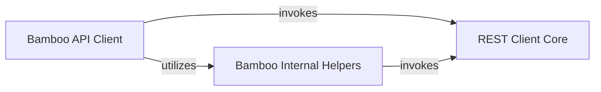

## Component Details

This graph illustrates the architecture of the Bamboo API Client, which facilitates interaction with the Bamboo CI/CD API. The core functionality revolves around the `Bamboo API Client` component, which leverages the `REST Client Core` for all HTTP communications. The `Bamboo Internal Helpers` component provides utility functions to assist the `Bamboo API Client` in processing API responses, particularly for pagination and list handling. The overall purpose is to provide a comprehensive and easy-to-use Python interface for managing various aspects of Bamboo, including projects, build plans, branches, build results, deployments, users, groups, permissions, agents, and reports.

### Bamboo API Client
This component provides a high-level interface for interacting with the Atlassian Bamboo REST API. It includes methods for managing projects, plans, builds, deployments, users, groups, agents, and plugins, abstracting the underlying HTTP communication.

**Related Classes/Methods**:

- <a href="https://github.com/atlassian-api/atlassian-python-api/blob/master/atlassian/bamboo.py#L11-L1472" target="_blank" rel="noopener noreferrer">`atlassian.bamboo.Bamboo` (11:1472)</a>

### REST Client Core
This core component handles the fundamental HTTP communication with Atlassian REST APIs. It provides generic methods for GET, POST, PUT, DELETE requests and utility for constructing resource URLs, serving as the backbone for various Atlassian product clients.

**Related Classes/Methods**:

- <a href="https://github.com/atlassian-api/atlassian-python-api/blob/master/atlassian/rest_client.py#L43-L1001" target="_blank" rel="noopener noreferrer">`atlassian.rest_client.AtlassianRestAPI` (43:1001)</a>

### Bamboo Internal Helpers
This component comprises internal utility methods within the Bamboo API Client, primarily responsible for handling common patterns like pagination and list retrieval from the Bamboo REST API.

**Related Classes/Methods**:

- <a href="https://github.com/atlassian-api/atlassian-python-api/blob/master/atlassian/bamboo.py#L65-L97" target="_blank" rel="noopener noreferrer">`atlassian.bamboo.Bamboo.base_list_call` (65:97)</a>
- <a href="https://github.com/atlassian-api/atlassian-python-api/blob/master/atlassian/bamboo.py#L14-L63" target="_blank" rel="noopener noreferrer">`atlassian.bamboo.Bamboo._get_generator` (14:63)</a>

### [FAQ](https://github.com/CodeBoarding/GeneratedOnBoardings/tree/main?tab=readme-ov-file#faq)