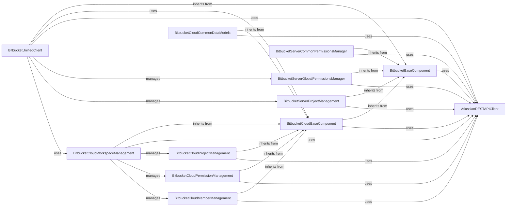

## Component Details

This graph illustrates the architecture of the Bitbucket API Client subsystem, which provides a unified interface for interacting with both Bitbucket Server and Bitbucket Cloud APIs. It details the core client, base components for common and platform-specific functionalities, and specialized managers for global permissions, project management, workspace management, and common data models, all relying on a low-level REST API client for communication.

### BitbucketUnifiedClient
Provides a unified interface for interacting with both Bitbucket Server and Bitbucket Cloud APIs, covering functionalities related to projects, repositories, branches, tags, pull requests, webhooks, users, groups, and various administrative and permission management tasks across both Bitbucket platforms.

**Related Classes/Methods**:

- `atlassian.bitbucket.Bitbucket` (full file reference)
- `atlassian.bitbucket.server.Server` (full file reference)
- `atlassian.bitbucket.cloud.Cloud` (full file reference)

### BitbucketBaseComponent
This foundational component provides common functionalities and attributes shared across different Bitbucket API clients, such as data updating, time format checking, and generic paged data retrieval. It serves as a base class for more specific Bitbucket implementations.

**Related Classes/Methods**:

- <a href="https://github.com/atlassian-api/atlassian-python-api/blob/master/atlassian/bitbucket/base.py#L14-L204" target="_blank" rel="noopener noreferrer">`atlassian.bitbucket.base.BitbucketBase` (14:204)</a>

### BitbucketCloudBaseComponent
This component extends the core Bitbucket base functionalities with features specific to the Bitbucket Cloud environment, such as handling cloud-specific links and paged data structures.

**Related Classes/Methods**:

- <a href="https://github.com/atlassian-api/atlassian-python-api/blob/master/atlassian/bitbucket/cloud/base.py#L11-L125" target="_blank" rel="noopener noreferrer">`atlassian.bitbucket.cloud.base.BitbucketCloudBase` (11:125)</a>

### AtlassianRESTAPIClient
A fundamental utility component responsible for executing all HTTP requests (GET, POST, PUT, DELETE) to Atlassian APIs and handling URL construction. It acts as the low-level communication layer for all higher-level API clients.

**Related Classes/Methods**:

- <a href="https://github.com/atlassian-api/atlassian-python-api/blob/master/atlassian/rest_client.py#L43-L1001" target="_blank" rel="noopener noreferrer">`atlassian.rest_client.AtlassianRestAPI` (43:1001)</a>

### BitbucketServerGlobalPermissionsManager
Manages global-level permissions for Bitbucket Server, allowing administrators to define and control access rights for users and groups across the entire Bitbucket instance.

**Related Classes/Methods**:

- <a href="https://github.com/atlassian-api/atlassian-python-api/blob/master/atlassian/bitbucket/server/globalPermissions.py#L6-L103" target="_blank" rel="noopener noreferrer">`atlassian.bitbucket.server.globalPermissions.GlobalPermissions` (6:103)</a>
- <a href="https://github.com/atlassian-api/atlassian-python-api/blob/master/atlassian/bitbucket/server/globalPermissions.py#L106-L111" target="_blank" rel="noopener noreferrer">`atlassian.bitbucket.server.globalPermissions.Groups` (106:111)</a>
- <a href="https://github.com/atlassian-api/atlassian-python-api/blob/master/atlassian/bitbucket/server/globalPermissions.py#L114-L119" target="_blank" rel="noopener noreferrer">`atlassian.bitbucket.server.globalPermissions.Users` (114:119)</a>
- <a href="https://github.com/atlassian-api/atlassian-python-api/blob/master/atlassian/bitbucket/server/globalPermissions.py#L122-L153" target="_blank" rel="noopener noreferrer">`atlassian.bitbucket.server.globalPermissions.PermissionBase` (122:153)</a>
- <a href="https://github.com/atlassian-api/atlassian-python-api/blob/master/atlassian/bitbucket/server/globalPermissions.py#L156-L164" target="_blank" rel="noopener noreferrer">`atlassian.bitbucket.server.globalPermissions.Group` (156:164)</a>
- <a href="https://github.com/atlassian-api/atlassian-python-api/blob/master/atlassian/bitbucket/server/globalPermissions.py#L167-L198" target="_blank" rel="noopener noreferrer">`atlassian.bitbucket.server.globalPermissions.User` (167:198)</a>

### BitbucketServerProjectManagement
Provides functionalities for managing projects within Bitbucket Server, including operations such as creating, retrieving, updating, and deleting projects, as well as handling project-specific permissions.

**Related Classes/Methods**:

- `atlassian.bitbucket.server.projects.Projects` (full file reference)
- `atlassian.bitbucket.server.projects.Project` (full file reference)

### BitbucketServerCommonPermissionsManager
Offers a shared set of functionalities for managing permissions in Bitbucket Server, applicable to both projects and repositories, enabling the assignment and revocation of read, write, and administrative access.

**Related Classes/Methods**:

- <a href="https://github.com/atlassian-api/atlassian-python-api/blob/master/atlassian/bitbucket/server/common/permissions.py#L6-L107" target="_blank" rel="noopener noreferrer">`atlassian.bitbucket.server.common.permissions.Permissions` (6:107)</a>
- <a href="https://github.com/atlassian-api/atlassian-python-api/blob/master/atlassian/bitbucket/server/common/permissions.py#L110-L115" target="_blank" rel="noopener noreferrer">`atlassian.bitbucket.server.common.permissions.Groups` (110:115)</a>
- <a href="https://github.com/atlassian-api/atlassian-python-api/blob/master/atlassian/bitbucket/server/common/permissions.py#L118-L123" target="_blank" rel="noopener noreferrer">`atlassian.bitbucket.server.common.permissions.Users` (118:123)</a>
- <a href="https://github.com/atlassian-api/atlassian-python-api/blob/master/atlassian/bitbucket/server/common/permissions.py#L126-L161" target="_blank" rel="noopener noreferrer">`atlassian.bitbucket.server.common.permissions.PermissionBase` (126:161)</a>
- <a href="https://github.com/atlassian-api/atlassian-python-api/blob/master/atlassian/bitbucket/server/common/permissions.py#L164-L173" target="_blank" rel="noopener noreferrer">`atlassian.bitbucket.server.common.permissions.Group` (164:173)</a>
- <a href="https://github.com/atlassian-api/atlassian-python-api/blob/master/atlassian/bitbucket/server/common/permissions.py#L176-L220" target="_blank" rel="noopener noreferrer">`atlassian.bitbucket.server.common.permissions.User` (176:220)</a>

### BitbucketCloudWorkspaceManagement
Manages workspaces in Bitbucket Cloud, providing methods to list, retrieve, and check the existence of workspaces. It also serves as an entry point for managing projects, members, and permissions associated with a specific workspace.

**Related Classes/Methods**:

- `atlassian.bitbucket.cloud.workspaces.Workspaces` (full file reference)
- `atlassian.bitbucket.cloud.workspaces.Workspace` (full file reference)

### BitbucketCloudProjectManagement
Focuses on project-related operations within Bitbucket Cloud workspaces, allowing for the creation, retrieval, updating, and deletion of projects.

**Related Classes/Methods**:

- <a href="https://github.com/atlassian-api/atlassian-python-api/blob/master/atlassian/bitbucket/cloud/workspaces/projects.py#L9-L120" target="_blank" rel="noopener noreferrer">`atlassian.bitbucket.cloud.workspaces.projects.Projects` (9:120)</a>
- <a href="https://github.com/atlassian-api/atlassian-python-api/blob/master/atlassian/bitbucket/cloud/workspaces/projects.py#L123-L215" target="_blank" rel="noopener noreferrer">`atlassian.bitbucket.cloud.workspaces.projects.Project` (123:215)</a>

### BitbucketCloudPermissionManagement
Handles the administration of permissions for Bitbucket Cloud workspaces and repositories, enabling the assignment and management of access rights for users and groups.

**Related Classes/Methods**:

- <a href="https://github.com/atlassian-api/atlassian-python-api/blob/master/atlassian/bitbucket/cloud/workspaces/permissions.py#L7-L52" target="_blank" rel="noopener noreferrer">`atlassian.bitbucket.cloud.workspaces.permissions.Permissions` (7:52)</a>
- <a href="https://github.com/atlassian-api/atlassian-python-api/blob/master/atlassian/bitbucket/cloud/workspaces/permissions.py#L55-L97" target="_blank" rel="noopener noreferrer">`atlassian.bitbucket.cloud.workspaces.permissions.WorkspaceMembership` (55:97)</a>
- <a href="https://github.com/atlassian-api/atlassian-python-api/blob/master/atlassian/bitbucket/cloud/workspaces/permissions.py#L100-L124" target="_blank" rel="noopener noreferrer">`atlassian.bitbucket.cloud.workspaces.permissions.RepositoryPermission` (100:124)</a>

### BitbucketCloudMemberManagement
Manages members within Bitbucket Cloud workspaces, providing functionalities to list and retrieve details of workspace members.

**Related Classes/Methods**:

- <a href="https://github.com/atlassian-api/atlassian-python-api/blob/master/atlassian/bitbucket/cloud/workspaces/members.py#L6-L39" target="_blank" rel="noopener noreferrer">`atlassian.bitbucket.cloud.workspaces.members.WorkspaceMembers` (6:39)</a>
- <a href="https://github.com/atlassian-api/atlassian-python-api/blob/master/atlassian/bitbucket/cloud/workspaces/members.py#L42-L64" target="_blank" rel="noopener noreferrer">`atlassian.bitbucket.cloud.workspaces.members.WorkspaceMember` (42:64)</a>

### BitbucketCloudCommonDataModels
Defines the data structures for common entities in Bitbucket Cloud, such as users, participants in pull requests, build statuses, and comments, facilitating consistent data representation across the API.

**Related Classes/Methods**:

- <a href="https://github.com/atlassian-api/atlassian-python-api/blob/master/atlassian/bitbucket/cloud/common/users.py#L4-L31" target="_blank" rel="noopener noreferrer">`atlassian.bitbucket.cloud.common.users.User` (4:31)</a>
- <a href="https://github.com/atlassian-api/atlassian-python-api/blob/master/atlassian/bitbucket/cloud/common/users.py#L34-L79" target="_blank" rel="noopener noreferrer">`atlassian.bitbucket.cloud.common.users.Participant` (34:79)</a>
- <a href="https://github.com/atlassian-api/atlassian-python-api/blob/master/atlassian/bitbucket/cloud/common/builds.py#L4-L86" target="_blank" rel="noopener noreferrer">`atlassian.bitbucket.cloud.common.builds.Build` (4:86)</a>
- <a href="https://github.com/atlassian-api/atlassian-python-api/blob/master/atlassian/bitbucket/cloud/common/comments.py#L5-L50" target="_blank" rel="noopener noreferrer">`atlassian.bitbucket.cloud.common.comments.Comment` (5:50)</a>

### [FAQ](https://github.com/CodeBoarding/GeneratedOnBoardings/tree/main?tab=readme-ov-file#faq)