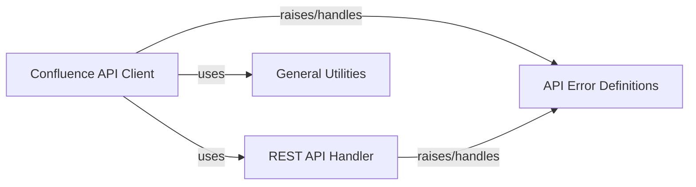

## Component Details

This graph illustrates the core components of the Confluence API Client subsystem within the `atlassian-python-api` library. The `Confluence API Client` acts as the primary interface for Confluence-specific operations, relying on the `REST API Handler` for all underlying HTTP communication. Error handling across the subsystem is centralized through `API Error Definitions`, which are utilized by both the `Confluence API Client` and the `REST API Handler`. Additionally, the `Confluence API Client` leverages `General Utilities` for data formatting and normalization tasks before interacting with the Confluence API.

### Confluence API Client
Facilitates interaction with the Confluence API, allowing operations on pages, spaces, comments, attachments, labels, content history, templates, and user/group permissions within Confluence.

**Related Classes/Methods**:

- `atlassian.confluence.Confluence` (full file reference)

### REST API Handler
This component is responsible for the core HTTP communication with Atlassian REST APIs. It manages the underlying network requests, handles different authentication mechanisms (basic, token, OAuth), applies request parameters and headers, and implements robust features like SSL verification, timeouts, and exponential backoff with retries for resilient API interactions.

**Related Classes/Methods**:

- <a href="https://github.com/atlassian-api/atlassian-python-api/blob/master/atlassian/rest_client.py#L43-L1001" target="_blank" rel="noopener noreferrer">`atlassian.rest_client.AtlassianRestAPI` (43:1001)</a>

### API Error Definitions
This component defines a set of custom exception classes that provide specific error types for various API-related failures. These exceptions allow for more precise error handling and differentiation of issues such as resource not found, permission denied, invalid input, or conflicts during API operations.

**Related Classes/Methods**:

- <a href="https://github.com/atlassian-api/atlassian-python-api/blob/master/atlassian/errors.py#L4-L7" target="_blank" rel="noopener noreferrer">`atlassian.errors.ApiError` (4:7)</a>
- <a href="https://github.com/atlassian-api/atlassian-python-api/blob/master/atlassian/errors.py#L10-L11" target="_blank" rel="noopener noreferrer">`atlassian.errors.ApiNotFoundError` (10:11)</a>
- <a href="https://github.com/atlassian-api/atlassian-python-api/blob/master/atlassian/errors.py#L14-L15" target="_blank" rel="noopener noreferrer">`atlassian.errors.ApiPermissionError` (14:15)</a>
- <a href="https://github.com/atlassian-api/atlassian-python-api/blob/master/atlassian/errors.py#L18-L19" target="_blank" rel="noopener noreferrer">`atlassian.errors.ApiValueError` (18:19)</a>
- <a href="https://github.com/atlassian-api/atlassian-python-api/blob/master/atlassian/errors.py#L22-L23" target="_blank" rel="noopener noreferrer">`atlassian.errors.ApiConflictError` (22:23)</a>

### General Utilities
This component offers a collection of general-purpose helper functions that support various aspects of the `atlassian-python-api` library. These utilities include functions for HTML content formatting (e.g., for Confluence page bodies) and character normalization, which are used to process or prepare data before sending it to or after receiving it from the Atlassian APIs.

**Related Classes/Methods**:

- <a href="https://github.com/atlassian-api/atlassian-python-api/blob/master/atlassian/utils.py#L260-L307" target="_blank" rel="noopener noreferrer">`atlassian.utils.symbol_normalizer` (260:307)</a>

### [FAQ](https://github.com/CodeBoarding/GeneratedOnBoardings/tree/main?tab=readme-ov-file#faq)