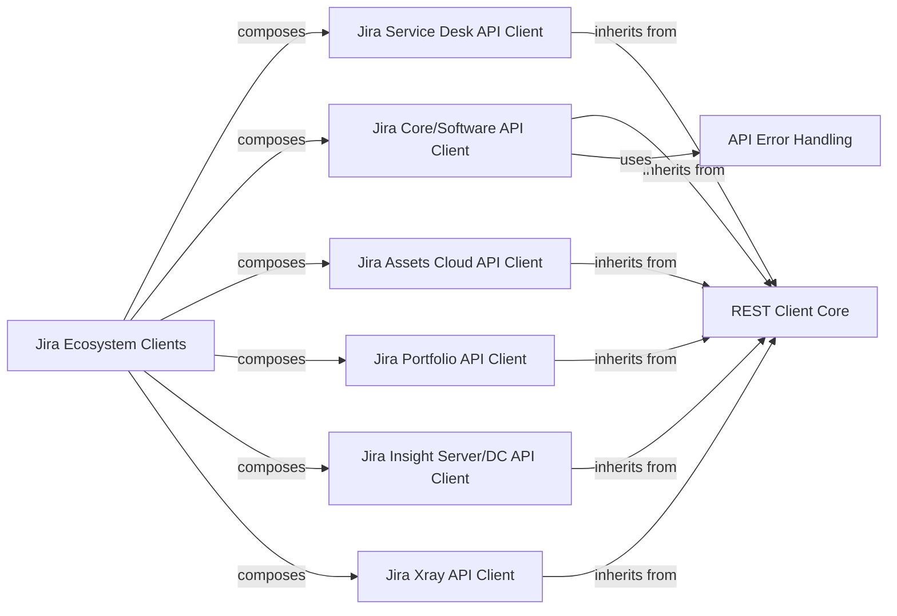

## Component Details

The Jira Ecosystem Clients component serves as a unified interface, abstracting interactions with various Atlassian Jira-related APIs. It consolidates functionalities from Jira Core/Software, Jira Service Desk, Atlassian Assets/Insight, Xray Test Management, and Jira Portfolio/Advanced Roadmaps. This component relies on a foundational REST Client Core for all low-level HTTP communications, which handles authentication, error handling, and retry mechanisms. Individual API clients for each Jira product inherit from or utilize this core client, providing specialized functionalities. The overall flow involves a consumer interacting with the consolidated Jira Ecosystem Clients, which then delegates specific requests to the appropriate underlying API client, leveraging the robust REST Client Core for network operations and standardized error handling.

### Jira Ecosystem Clients
A consolidated interface for interacting with various Jira-related APIs, including core Jira functionalities (issues, projects, users), Jira Service Desk (customer requests, SLAs), Atlassian Assets/Insight (configuration items), Xray Test Management (tests, test runs), and Jira Portfolio/Advanced Roadmaps (planning data). This component abstracts the specific API calls for these interconnected Jira products.

**Related Classes/Methods**:

- <a href="https://github.com/atlassian-api/atlassian-python-api/blob/master/atlassian/jira.py#L19-L5794" target="_blank" rel="noopener noreferrer">`atlassian.jira.Jira` (19:5794)</a>
- <a href="https://github.com/atlassian-api/atlassian-python-api/blob/master/atlassian/service_desk.py#L11-L929" target="_blank" rel="noopener noreferrer">`atlassian.service_desk.ServiceDesk` (11:929)</a>
- <a href="https://github.com/atlassian-api/atlassian-python-api/blob/master/atlassian/assets.py#L11-L626" target="_blank" rel="noopener noreferrer">`atlassian.assets.AssetsCloud` (11:626)</a>
- <a href="https://github.com/atlassian-api/atlassian-python-api/blob/master/atlassian/insight.py#L10-L677" target="_blank" rel="noopener noreferrer">`atlassian.insight.Insight` (10:677)</a>
- <a href="https://github.com/atlassian-api/atlassian-python-api/blob/master/atlassian/xray.py#L10-L662" target="_blank" rel="noopener noreferrer">`atlassian.xray.Xray` (10:662)</a>
- <a href="https://github.com/atlassian-api/atlassian-python-api/blob/master/atlassian/portfolio.py#L9-L108" target="_blank" rel="noopener noreferrer">`atlassian.portfolio.Portfolio` (9:108)</a>

### REST Client Core
This is the foundational component responsible for handling all low-level HTTP requests (GET, POST, PUT, DELETE, PATCH) to Atlassian REST APIs. It manages authentication (basic, token, OAuth, Kerberos), SSL verification, request timeouts, and implements exponential backoff and retry mechanisms for robust communication. It also provides utility methods for URL construction and response parsing.

**Related Classes/Methods**:

- <a href="https://github.com/atlassian-api/atlassian-python-api/blob/master/atlassian/rest_client.py#L43-L1001" target="_blank" rel="noopener noreferrer">`atlassian.rest_client.AtlassianRestAPI` (43:1001)</a>

### Jira Service Desk API Client
This component provides a high-level interface for interacting with the Jira Service Desk API. It encapsulates specific Service Desk functionalities such as managing service desks, customers, customer requests, comments, organizations, attachments, SLAs, and approvals. It relies on the REST Client Core for all underlying HTTP operations.

**Related Classes/Methods**:

- <a href="https://github.com/atlassian-api/atlassian-python-api/blob/master/atlassian/service_desk.py#L11-L929" target="_blank" rel="noopener noreferrer">`atlassian.service_desk.ServiceDesk` (11:929)</a>

### Jira Core/Software API Client
This is a comprehensive client for the Jira Core and Jira Software APIs. It offers extensive functionalities for managing issues (create, update, delete, transition, comments, attachments, links, properties, worklogs), projects (create, delete, archive, versions, components, roles, permissions, notifications), users, groups, dashboards, filters, and integrates with Jira Agile (boards, sprints, epics, ranking) and Tempo (accounts, holidays, timesheets, teams). All its interactions with Jira are performed via the REST Client Core.

**Related Classes/Methods**:

- <a href="https://github.com/atlassian-api/atlassian-python-api/blob/master/atlassian/jira.py#L19-L5794" target="_blank" rel="noopener noreferrer">`atlassian.jira.Jira` (19:5794)</a>

### Jira Assets Cloud API Client
This component provides an interface for managing Assets (formerly Insight) data within Jira Cloud. It handles operations related to objects, object schemas, attributes, attachments, comments, icons, and import/reindex processes. It extends the REST Client Core and includes specific logic for cloud workspace identification.

**Related Classes/Methods**:

- <a href="https://github.com/atlassian-api/atlassian-python-api/blob/master/atlassian/assets.py#L11-L626" target="_blank" rel="noopener noreferrer">`atlassian.assets.AssetsCloud` (11:626)</a>

### Jira Portfolio API Client
This component is designed to interact with the Jira Portfolio (now Advanced Roadmaps) API. It provides methods to retrieve information about plans, epics, stages, teams, persons, streams, releases, themes, and dependencies. It also supports importing work items and querying issues via JQL for portfolio purposes. It uses the REST Client Core for its API calls.

**Related Classes/Methods**:

- <a href="https://github.com/atlassian-api/atlassian-python-api/blob/master/atlassian/portfolio.py#L9-L108" target="_blank" rel="noopener noreferrer">`atlassian.portfolio.Portfolio` (9:108)</a>

### Jira Insight Server/DC API Client
This component provides an interface for managing Insight (now Assets) data in Jira Server/Data Center environments. Similar to AssetsCloud, it handles objects, schemas, attributes, attachments, comments, icons, and import/reindex processes, but is tailored for non-cloud deployments. It extends the REST Client Core.

**Related Classes/Methods**:

- <a href="https://github.com/atlassian-api/atlassian-python-api/blob/master/atlassian/insight.py#L10-L677" target="_blank" rel="noopener noreferrer">`atlassian.insight.Insight` (10:677)</a>

### Jira Xray API Client
This component provides a specialized client for the Jira Xray Test Management API. It enables management of tests, test steps, test runs, preconditions, test sets, and test plans. It overrides the base resource_url method to fit Xray's specific API path structure and relies on the REST Client Core for all HTTP requests.

**Related Classes/Methods**:

- <a href="https://github.com/atlassian-api/atlassian-python-api/blob/master/atlassian/xray.py#L10-L662" target="_blank" rel="noopener noreferrer">`atlassian.xray.Xray` (10:662)</a>

### API Error Handling
This component defines custom exception classes (ApiNotFoundError, ApiPermissionError, ApiValueError, ApiConflictError, ApiNotAcceptable) that are raised by the API clients to indicate specific error conditions encountered during API interactions. This allows for more precise error handling by the consumer of the library.

**Related Classes/Methods**:

- <a href="https://github.com/atlassian-api/atlassian-python-api/blob/master/atlassian/errors.py#L10-L11" target="_blank" rel="noopener noreferrer">`atlassian.errors.ApiNotFoundError` (10:11)</a>
- <a href="https://github.com/atlassian-api/atlassian-python-api/blob/master/atlassian/errors.py#L14-L15" target="_blank" rel="noopener noreferrer">`atlassian.errors.ApiPermissionError` (14:15)</a>
- <a href="https://github.com/atlassian-api/atlassian-python-api/blob/master/atlassian/errors.py#L18-L19" target="_blank" rel="noopener noreferrer">`atlassian.errors.ApiValueError` (18:19)</a>
- <a href="https://github.com/atlassian-api/atlassian-python-api/blob/master/atlassian/errors.py#L22-L23" target="_blank" rel="noopener noreferrer">`atlassian.errors.ApiConflictError` (22:23)</a>
- <a href="https://github.com/atlassian-api/atlassian-python-api/blob/master/atlassian/errors.py#L26-L27" target="_blank" rel="noopener noreferrer">`atlassian.errors.ApiNotAcceptable` (26:27)</a>

### [FAQ](https://github.com/CodeBoarding/GeneratedOnBoardings/tree/main?tab=readme-ov-file#faq)