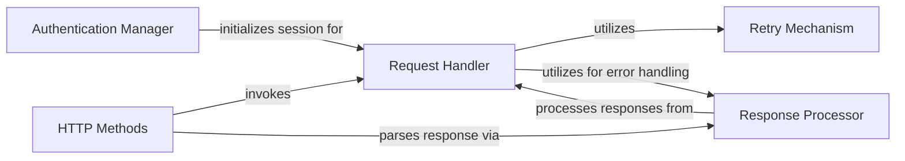

## Component Details

The REST Client Core is the foundational component responsible for managing all HTTP communication with Atlassian APIs. It handles various authentication schemes, constructs API URLs, executes HTTP requests with robust retry mechanisms (including exponential backoff and `Retry-After` header support), and processes responses by handling SSL verification, proxy settings, and error conditions. It serves as the underlying layer for all specific Atlassian product API clients, providing a consistent and reliable interface for API interactions.

### Authentication Manager
Manages various authentication mechanisms (basic, token, OAuth1, OAuth2, Kerberos, custom headers) by configuring the underlying `requests.Session` object. It ensures that all outgoing requests are properly authenticated.

**Related Classes/Methods**:

- <a href="https://github.com/atlassian-api/atlassian-python-api/blob/master/atlassian/rest_client.py#L72-L202" target="_blank" rel="noopener noreferrer">`atlassian-python-api.atlassian.rest_client.AtlassianRestAPI:__init__` (72:202)</a>
- <a href="https://github.com/atlassian-api/atlassian-python-api/blob/master/atlassian/rest_client.py#L210-L211" target="_blank" rel="noopener noreferrer">`atlassian-python-api.atlassian.rest_client.AtlassianRestAPI:_create_basic_session` (210:211)</a>
- <a href="https://github.com/atlassian-api/atlassian-python-api/blob/master/atlassian/rest_client.py#L213-L214" target="_blank" rel="noopener noreferrer">`atlassian-python-api.atlassian.rest_client.AtlassianRestAPI:_create_token_session` (213:214)</a>
- <a href="https://github.com/atlassian-api/atlassian-python-api/blob/master/atlassian/rest_client.py#L224-L232" target="_blank" rel="noopener noreferrer">`atlassian-python-api.atlassian.rest_client.AtlassianRestAPI:_create_oauth_session` (224:232)</a>
- <a href="https://github.com/atlassian-api/atlassian-python-api/blob/master/atlassian/rest_client.py#L234-L245" target="_blank" rel="noopener noreferrer">`atlassian-python-api.atlassian.rest_client.AtlassianRestAPI:_create_oauth2_session` (234:245)</a>
- <a href="https://github.com/atlassian-api/atlassian-python-api/blob/master/atlassian/rest_client.py#L219-L222" target="_blank" rel="noopener noreferrer">`atlassian-python-api.atlassian.rest_client.AtlassianRestAPI:_create_kerberos_session` (219:222)</a>
- <a href="https://github.com/atlassian-api/atlassian-python-api/blob/master/atlassian/rest_client.py#L216-L217" target="_blank" rel="noopener noreferrer">`atlassian-python-api.atlassian.rest_client.AtlassianRestAPI:_create_header_session` (216:217)</a>

### Request Handler
Responsible for constructing and executing HTTP requests. It builds the full URL, applies headers, handles request data (JSON, form data, files), and integrates the retry mechanism before sending the request via the `requests.Session`.

**Related Classes/Methods**:

- <a href="https://github.com/atlassian-api/atlassian-python-api/blob/master/atlassian/rest_client.py#L365-L446" target="_blank" rel="noopener noreferrer">`atlassian-python-api.atlassian.rest_client.AtlassianRestAPI:request` (365:446)</a>
- <a href="https://github.com/atlassian-api/atlassian-python-api/blob/master/atlassian/rest_client.py#L356-L360" target="_blank" rel="noopener noreferrer">`atlassian-python-api.atlassian.rest_client.AtlassianRestAPI:url_joiner` (356:360)</a>
- <a href="https://github.com/atlassian-api/atlassian-python-api/blob/master/atlassian/rest_client.py#L346-L353" target="_blank" rel="noopener noreferrer">`atlassian-python-api.atlassian.rest_client.AtlassianRestAPI:resource_url` (346:353)</a>
- <a href="https://github.com/atlassian-api/atlassian-python-api/blob/master/atlassian/rest_client.py#L320-L344" target="_blank" rel="noopener noreferrer">`atlassian-python-api.atlassian.rest_client.AtlassianRestAPI:log_curl_debug` (320:344)</a>

### Response Processor
Handles the parsing and error checking of HTTP responses. It attempts to convert responses to JSON and raises specific `HTTPError` exceptions for status codes indicating failure, providing detailed error messages where available.

**Related Classes/Methods**:

- <a href="https://github.com/atlassian-api/atlassian-python-api/blob/master/atlassian/rest_client.py#L964-L996" target="_blank" rel="noopener noreferrer">`atlassian-python-api.atlassian.rest_client.AtlassianRestAPI:raise_for_status` (964:996)</a>
- <a href="https://github.com/atlassian-api/atlassian-python-api/blob/master/atlassian/rest_client.py#L257-L265" target="_blank" rel="noopener noreferrer">`atlassian-python-api.atlassian.rest_client.AtlassianRestAPI:_response_handler` (257:265)</a>

### Retry Mechanism
Implements a robust retry strategy for failed HTTP requests. It supports exponential backoff, random jitter, and respects the `Retry-After` header, ensuring that API calls are retried intelligently to handle rate limits and transient errors.

**Related Classes/Methods**:

- <a href="https://github.com/atlassian-api/atlassian-python-api/blob/master/atlassian/rest_client.py#L288-L318" target="_blank" rel="noopener noreferrer">`atlassian-python-api.atlassian.rest_client.AtlassianRestAPI:_retry_handler` (288:318)</a>
- <a href="https://github.com/atlassian-api/atlassian-python-api/blob/master/atlassian/rest_client.py#L267-L286" target="_blank" rel="noopener noreferrer">`atlassian-python-api.atlassian.rest_client.AtlassianRestAPI:_calculate_backoff_value` (267:286)</a>

### HTTP Methods
Provides a set of high-level, user-friendly methods for common HTTP verbs (GET, POST, PUT, PATCH, DELETE). These methods abstract the complexities of the `request` method, allowing users to perform standard API operations with simplified parameters.

**Related Classes/Methods**:

- <a href="https://github.com/atlassian-api/atlassian-python-api/blob/master/atlassian/rest_client.py#L450-L463" target="_blank" rel="noopener noreferrer">`atlassian-python-api.atlassian.rest_client.AtlassianRestAPI:get` (450:463)</a>
- <a href="https://github.com/atlassian-api/atlassian-python-api/blob/master/atlassian/rest_client.py#L610-L623" target="_blank" rel="noopener noreferrer">`atlassian-python-api.atlassian.rest_client.AtlassianRestAPI:post` (610:623)</a>
- <a href="https://github.com/atlassian-api/atlassian-python-api/blob/master/atlassian/rest_client.py#L731-L743" target="_blank" rel="noopener noreferrer">`atlassian-python-api.atlassian.rest_client.AtlassianRestAPI:put` (731:743)</a>
- <a href="https://github.com/atlassian-api/atlassian-python-api/blob/master/atlassian/rest_client.py#L832-L867" target="_blank" rel="noopener noreferrer">`atlassian-python-api.atlassian.rest_client.AtlassianRestAPI:patch` (832:867)</a>
- <a href="https://github.com/atlassian-api/atlassian-python-api/blob/master/atlassian/rest_client.py#L871-L882" target="_blank" rel="noopener noreferrer">`atlassian-python-api.atlassian.rest_client.AtlassianRestAPI:delete` (871:882)</a>

### [FAQ](https://github.com/CodeBoarding/GeneratedOnBoardings/tree/main?tab=readme-ov-file#faq)