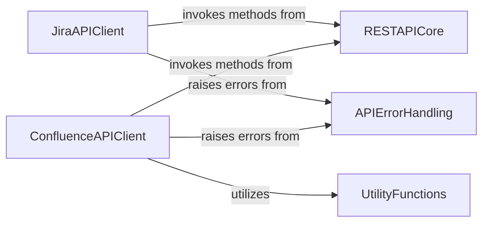

## Component Details

This graph represents the core components of the Atlassian Python API library, focusing on its interaction with Jira and Confluence, underlying REST API communication, general utility functions, and a structured approach to API error handling. The main flow involves API clients (Jira and Confluence) utilizing a central REST API core for communication and relying on a dedicated error handling component for robust error management. Additionally, the Confluence API client leverages general utility functions for common tasks.

### JiraAPIClient
This component provides an interface for interacting with the Jira API. It encapsulates methods for retrieving issue details and managing project security schemes, handling specific Jira-related operations.

**Related Classes/Methods**:

- <a href="https://github.com/atlassian-api/atlassian-python-api/blob/master/atlassian/jira.py#L1804-L1841" target="_blank" rel="noopener noreferrer">`atlassian-python-api.atlassian.jira.Jira:scrap_regex_from_issue` (1804:1841)</a>
- <a href="https://github.com/atlassian-api/atlassian-python-api/blob/master/atlassian/jira.py#L1163-L1195" target="_blank" rel="noopener noreferrer">`atlassian-python-api.atlassian.jira.Jira.get_issue` (1163:1195)</a>
- <a href="https://github.com/atlassian-api/atlassian-python-api/blob/master/atlassian/jira.py#L4139-L4167" target="_blank" rel="noopener noreferrer">`atlassian-python-api.atlassian.jira.Jira:get_project_issue_security_scheme` (4139:4167)</a>

### ConfluenceAPIClient
This component is responsible for all interactions with the Confluence API. It offers a comprehensive set of functionalities including page creation, retrieval, update, and deletion, attachment management, space operations, user and group details, and content templating.

**Related Classes/Methods**:

- `atlassian-python-api.atlassian.confluence.Confluence:page_exists` (full file reference)
- `atlassian-python-api.atlassian.confluence.Confluence:get_page_child_by_type` (full file reference)
- `atlassian-python-api.atlassian.confluence.Confluence._get_paged` (full file reference)
- `atlassian-python-api.atlassian.confluence.Confluence:get_page_by_title` (full file reference)
- `atlassian-python-api.atlassian.confluence.Confluence:get_page_by_id` (full file reference)
- `atlassian-python-api.atlassian.confluence.Confluence:get_tables_from_page` (full file reference)
- `atlassian-python-api.atlassian.confluence.Confluence:scrap_regex_from_page` (full file reference)
- `atlassian-python-api.atlassian.confluence.Confluence:get_page_labels` (full file reference)
- `atlassian-python-api.atlassian.confluence.Confluence:get_page_comments` (full file reference)
- `atlassian-python-api.atlassian.confluence.Confluence:get_all_pages_by_label` (full file reference)
- `atlassian-python-api.atlassian.confluence.Confluence:get_all_pages_from_space_raw` (full file reference)
- `atlassian-python-api.atlassian.confluence.Confluence:get_all_draft_pages_from_space_through_cql` (full file reference)
- `atlassian-python-api.atlassian.confluence.Confluence:get_all_pages_by_space_ids_confluence_cloud` (full file reference)
- `atlassian-python-api.atlassian.confluence.Confluence:remove_content` (full file reference)
- `atlassian-python-api.atlassian.confluence.Confluence:remove_page` (full file reference)
- `atlassian-python-api.atlassian.confluence.Confluence:create_page` (full file reference)
- `atlassian-python-api.atlassian.confluence.Confluence._create_body` (full file reference)
- `atlassian-python-api.atlassian.confluence.Confluence:get_template_by_id` (full file reference)
- `atlassian-python-api.atlassian.confluence.Confluence:get_content_template` (full file reference)
- `atlassian-python-api.atlassian.confluence.Confluence:get_all_blueprints_from_space` (full file reference)
- `atlassian-python-api.atlassian.confluence.Confluence:get_blueprint_templates` (full file reference)
- `atlassian-python-api.atlassian.confluence.Confluence:get_all_templates_from_space` (full file reference)
- `atlassian-python-api.atlassian.confluence.Confluence:get_content_templates` (full file reference)
- `atlassian-python-api.atlassian.confluence.Confluence:add_comment` (full file reference)
- `atlassian-python-api.atlassian.confluence.Confluence:attach_content` (full file reference)
- `atlassian-python-api.atlassian.confluence.Confluence.get_page_id` (full file reference)
- `atlassian-python-api.atlassian.confluence.Confluence:get_attachments_from_content` (full file reference)
- `atlassian-python-api.atlassian.confluence.Confluence:set_page_label` (full file reference)
- `atlassian-python-api.atlassian.confluence.Confluence:remove_page_label` (full file reference)
- `atlassian-python-api.atlassian.confluence.Confluence:history` (full file reference)
- `atlassian-python-api.atlassian.confluence.Confluence:update_page` (full file reference)
- `atlassian-python-api.atlassian.confluence.Confluence.is_page_content_is_already_updated` (full file reference)
- `atlassian-python-api.atlassian.confluence.Confluence:_insert_to_existing_page` (full file reference)
- `atlassian-python-api.atlassian.confluence.Confluence:set_page_property` (full file reference)
- `atlassian-python-api.atlassian.confluence.Confluence:update_page_property` (full file reference)
- `atlassian-python-api.atlassian.confluence.Confluence:delete_page_property` (full file reference)
- `atlassian-python-api.atlassian.confluence.Confluence:get_page_property` (full file reference)
- `atlassian-python-api.atlassian.confluence.Confluence:get_page_properties` (full file reference)
- `atlassian-python-api.atlassian.confluence.Confluence:get_page_ancestors` (full file reference)
- `atlassian-python-api.atlassian.confluence.Confluence:get_all_groups` (full file reference)
- `atlassian-python-api.atlassian.confluence.Confluence:get_group_members` (full file reference)
- `atlassian-python-api.atlassian.confluence.Confluence:get_space` (full file reference)
- `atlassian-python-api.atlassian.confluence.Confluence:get_space_content` (full file reference)
- `atlassian-python-api.atlassian.confluence.Confluence:delete_space` (full file reference)
- `atlassian-python-api.atlassian.confluence.Confluence:get_space_property` (full file reference)
- `atlassian-python-api.atlassian.confluence.Confluence:get_user_details_by_username` (full file reference)
- `atlassian-python-api.atlassian.confluence.Confluence:get_user_details_by_accountid` (full file reference)
- `atlassian-python-api.atlassian.confluence.Confluence:get_user_details_by_userkey` (full file reference)
- `atlassian-python-api.atlassian.confluence.Confluence:cql` (full file reference)
- `atlassian-python-api.atlassian.confluence.Confluence:get_page_as_pdf` (full file reference)
- `atlassian-python-api.atlassian.confluence.Confluence.get_pdf_download_url_for_confluence_cloud` (full file reference)
- `atlassian-python-api.atlassian.confluence.Confluence:get_space_export` (full file reference)
- `atlassian-python-api.atlassian.confluence.Confluence.get_space_export.get_atl_request` (full file reference)
- `atlassian-python-api.atlassian.confluence.Confluence:get_descendant_page_id` (full file reference)
- `atlassian-python-api.atlassian.confluence.Confluence:check_long_task_result` (full file reference)
- `atlassian-python-api.atlassian.confluence.Confluence:anonymous` (full file reference)
- `atlassian-python-api.atlassian.confluence.Confluence:get_whiteboard` (full file reference)
- `atlassian-python-api.atlassian.confluence.Confluence:delete_whiteboard` (full file reference)

### UtilityFunctions
This component provides a collection of utility functions that assist in common tasks such as generating HTML structures (lists, table rows, and full tables from dictionaries) and validating email addresses. These functions are generally reusable across different parts of the application.

**Related Classes/Methods**:

- `atlassian-python-api.atlassian.utils` (full file reference)

### RESTAPICore
This is the foundational component for all REST API communications within the Atlassian Python API. It handles the core functionalities of making HTTP requests (GET, POST, PUT, DELETE), constructing resource URLs, and serving as the primary interface for interacting with Atlassian services at a low level.

**Related Classes/Methods**:

- <a href="https://github.com/atlassian-api/atlassian-python-api/blob/master/atlassian/rest_client.py#L346-L353" target="_blank" rel="noopener noreferrer">`atlassian-python-api.atlassian.rest_client.AtlassianRestAPI.resource_url` (346:353)</a>
- <a href="https://github.com/atlassian-api/atlassian-python-api/blob/master/atlassian/rest_client.py#L450-L463" target="_blank" rel="noopener noreferrer">`atlassian-python-api.atlassian.rest_client.AtlassianRestAPI.get` (450:463)</a>
- <a href="https://github.com/atlassian-api/atlassian-python-api/blob/master/atlassian/rest_client.py#L610-L623" target="_blank" rel="noopener noreferrer">`atlassian-python-api.atlassian.rest_client.AtlassianRestAPI.post` (610:623)</a>
- <a href="https://github.com/atlassian-api/atlassian-python-api/blob/master/atlassian/rest_client.py#L871-L882" target="_blank" rel="noopener noreferrer">`atlassian-python-api.atlassian.rest_client.AtlassianRestAPI.delete` (871:882)</a>
- <a href="https://github.com/atlassian-api/atlassian-python-api/blob/master/atlassian/rest_client.py#L731-L743" target="_blank" rel="noopener noreferrer">`atlassian-python-api.atlassian.rest_client.AtlassianRestAPI.put` (731:743)</a>
- <a href="https://github.com/atlassian-api/atlassian-python-api/blob/master/atlassian/rest_client.py#L356-L360" target="_blank" rel="noopener noreferrer">`atlassian-python-api.atlassian.rest_client.AtlassianRestAPI.url_joiner` (356:360)</a>

### APIErrorHandling
This component defines and manages various custom exception types that represent specific errors encountered during API interactions. It provides a structured way to handle different error scenarios such as not found resources, permission issues, invalid values, and conflicts.

**Related Classes/Methods**:

- <a href="https://github.com/atlassian-api/atlassian-python-api/blob/master/atlassian/errors.py#L10-L11" target="_blank" rel="noopener noreferrer">`atlassian-python-api.atlassian.errors.ApiNotFoundError` (10:11)</a>
- <a href="https://github.com/atlassian-api/atlassian-python-api/blob/master/atlassian/errors.py#L14-L15" target="_blank" rel="noopener noreferrer">`atlassian-python-api.atlassian.errors.ApiPermissionError` (14:15)</a>
- <a href="https://github.com/atlassian-api/atlassian-python-api/blob/master/atlassian/errors.py#L4-L7" target="_blank" rel="noopener noreferrer">`atlassian-python-api.atlassian.errors.ApiError` (4:7)</a>
- <a href="https://github.com/atlassian-api/atlassian-python-api/blob/master/atlassian/errors.py#L18-L19" target="_blank" rel="noopener noreferrer">`atlassian-python-api.atlassian.errors.ApiValueError` (18:19)</a>
- <a href="https://github.com/atlassian-api/atlassian-python-api/blob/master/atlassian/errors.py#L22-L23" target="_blank" rel="noopener noreferrer">`atlassian-python-api.atlassian.errors.ApiConflictError` (22:23)</a>

### [FAQ](https://github.com/CodeBoarding/GeneratedOnBoardings/tree/main?tab=readme-ov-file#faq)