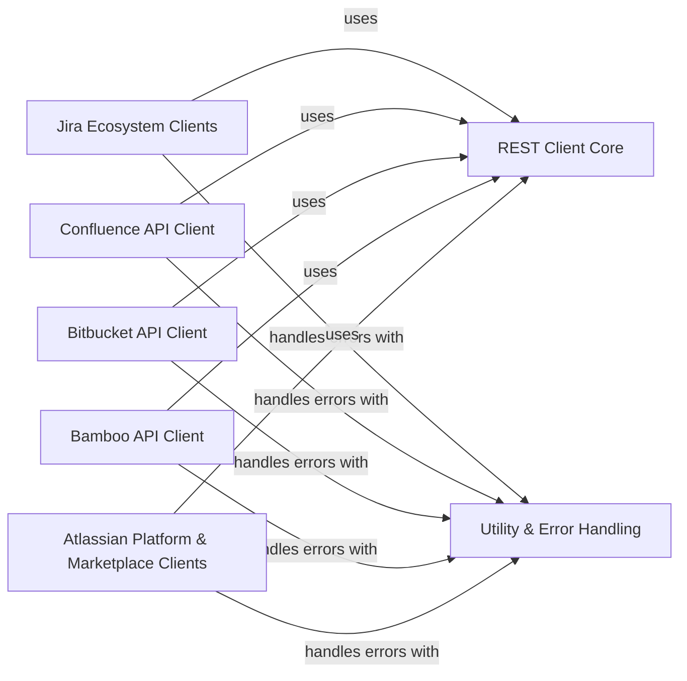

## Component Details

The `atlassian-python-api` library provides a comprehensive Python interface for interacting with various Atlassian products. The core functionality revolves around a `REST Client Core` that handles all HTTP communication, including authentication, retries, and error handling. Specific API clients for products like Jira, Confluence, Bitbucket, Bamboo, and other Atlassian platform services build upon this core, abstracting the complexities of their respective APIs. The `Utility & Error Handling` component provides common utilities and a structured approach to managing API-related errors across all clients. The main flow involves client applications instantiating specific Atlassian product API clients, which then leverage the `REST Client Core` to perform operations, with errors being managed by the `Utility & Error Handling` component.

### REST Client Core
The foundational component responsible for handling all HTTP requests and responses with Atlassian APIs. It manages session authentication (basic, token, OAuth1, OAuth2, Kerberos), implements robust retry mechanisms with exponential backoff and `Retry-After` header support, handles SSL verification, proxy settings, and constructs API URLs. It serves as the base for all specific Atlassian product API clients.

**Related Classes/Methods**:

- <a href="https://github.com/atlassian-api/atlassian-python-api/blob/master/atlassian/rest_client.py#L43-L1001" target="_blank" rel="noopener noreferrer">`atlassian-python-api.atlassian.rest_client.AtlassianRestAPI` (43:1001)</a>
- <a href="https://github.com/atlassian-api/atlassian-python-api/blob/master/atlassian/rest_client.py#L72-L202" target="_blank" rel="noopener noreferrer">`atlassian-python-api.atlassian.rest_client.AtlassianRestAPI:__init__` (72:202)</a>
- <a href="https://github.com/atlassian-api/atlassian-python-api/blob/master/atlassian/rest_client.py#L365-L446" target="_blank" rel="noopener noreferrer">`atlassian-python-api.atlassian.rest_client.AtlassianRestAPI:request` (365:446)</a>
- <a href="https://github.com/atlassian-api/atlassian-python-api/blob/master/atlassian/rest_client.py#L288-L318" target="_blank" rel="noopener noreferrer">`atlassian-python-api.atlassian.rest_client.AtlassianRestAPI:_retry_handler` (288:318)</a>
- <a href="https://github.com/atlassian-api/atlassian-python-api/blob/master/atlassian/rest_client.py#L267-L286" target="_blank" rel="noopener noreferrer">`atlassian-python-api.atlassian.rest_client.AtlassianRestAPI:_calculate_backoff_value` (267:286)</a>
- <a href="https://github.com/atlassian-api/atlassian-python-api/blob/master/atlassian/rest_client.py#L964-L996" target="_blank" rel="noopener noreferrer">`atlassian-python-api.atlassian.rest_client.AtlassianRestAPI:raise_for_status` (964:996)</a>
- <a href="https://github.com/atlassian-api/atlassian-python-api/blob/master/atlassian/rest_client.py#L210-L211" target="_blank" rel="noopener noreferrer">`atlassian-python-api.atlassian.rest_client.AtlassianRestAPI:_create_basic_session` (210:211)</a>
- <a href="https://github.com/atlassian-api/atlassian-python-api/blob/master/atlassian/rest_client.py#L213-L214" target="_blank" rel="noopener noreferrer">`atlassian-python-api.atlassian.rest_client.AtlassianRestAPI:_create_token_session` (213:214)</a>
- <a href="https://github.com/atlassian-api/atlassian-python-api/blob/master/atlassian/rest_client.py#L224-L232" target="_blank" rel="noopener noreferrer">`atlassian-python-api.atlassian.rest_client.AtlassianRestAPI:_create_oauth_session` (224:232)</a>
- <a href="https://github.com/atlassian-api/atlassian-python-api/blob/master/atlassian/rest_client.py#L234-L245" target="_blank" rel="noopener noreferrer">`atlassian-python-api.atlassian.rest_client.AtlassianRestAPI:_create_oauth2_session` (234:245)</a>
- <a href="https://github.com/atlassian-api/atlassian-python-api/blob/master/atlassian/rest_client.py#L219-L222" target="_blank" rel="noopener noreferrer">`atlassian-python-api.atlassian.rest_client.AtlassianRestAPI:_create_kerberos_session` (219:222)</a>
- <a href="https://github.com/atlassian-api/atlassian-python-api/blob/master/atlassian/rest_client.py#L356-L360" target="_blank" rel="noopener noreferrer">`atlassian-python-api.atlassian.rest_client.AtlassianRestAPI:url_joiner` (356:360)</a>
- <a href="https://github.com/atlassian-api/atlassian-python-api/blob/master/atlassian/rest_client.py#L346-L353" target="_blank" rel="noopener noreferrer">`atlassian-python-api.atlassian.rest_client.AtlassianRestAPI:resource_url` (346:353)</a>
- <a href="https://github.com/atlassian-api/atlassian-python-api/blob/master/atlassian/rest_client.py#L450-L463" target="_blank" rel="noopener noreferrer">`atlassian-python-api.atlassian.rest_client.AtlassianRestAPI:get` (450:463)</a>
- <a href="https://github.com/atlassian-api/atlassian-python-api/blob/master/atlassian/rest_client.py#L610-L623" target="_blank" rel="noopener noreferrer">`atlassian-python-api.atlassian.rest_client.AtlassianRestAPI:post` (610:623)</a>
- <a href="https://github.com/atlassian-api/atlassian-python-api/blob/master/atlassian/rest_client.py#L731-L743" target="_blank" rel="noopener noreferrer">`atlassian-python-api.atlassian.rest_client.AtlassianRestAPI:put` (731:743)</a>
- <a href="https://github.com/atlassian-api/atlassian-python-api/blob/master/atlassian/rest_client.py#L832-L867" target="_blank" rel="noopener noreferrer">`atlassian-python-api.atlassian.rest_client.AtlassianRestAPI:patch` (832:867)</a>
- <a href="https://github.com/atlassian-api/atlassian-python-api/blob/master/atlassian/rest_client.py#L871-L882" target="_blank" rel="noopener noreferrer">`atlassian-python-api.atlassian.rest_client.AtlassianRestAPI:delete` (871:882)</a>

### Jira Ecosystem Clients
A consolidated interface for interacting with various Jira-related APIs, including core Jira functionalities (issues, projects, users), Jira Service Desk (customer requests, SLAs), Atlassian Assets/Insight (configuration items), Xray Test Management (tests, test runs), and Jira Portfolio/Advanced Roadmaps (planning data). This component abstracts the specific API calls for these interconnected Jira products.

**Related Classes/Methods**:

- <a href="https://github.com/atlassian-api/atlassian-python-api/blob/master/atlassian/jira.py#L19-L5794" target="_blank" rel="noopener noreferrer">`atlassian-python-api.atlassian.jira.Jira` (19:5794)</a>
- <a href="https://github.com/atlassian-api/atlassian-python-api/blob/master/atlassian/service_desk.py#L11-L929" target="_blank" rel="noopener noreferrer">`atlassian-python-api.atlassian.service_desk.ServiceDesk` (11:929)</a>
- <a href="https://github.com/atlassian-api/atlassian-python-api/blob/master/atlassian/assets.py#L11-L626" target="_blank" rel="noopener noreferrer">`atlassian-python-api.atlassian.assets.AssetsCloud` (11:626)</a>
- <a href="https://github.com/atlassian-api/atlassian-python-api/blob/master/atlassian/insight.py#L10-L677" target="_blank" rel="noopener noreferrer">`atlassian-python-api.atlassian.insight.Insight` (10:677)</a>
- <a href="https://github.com/atlassian-api/atlassian-python-api/blob/master/atlassian/xray.py#L10-L662" target="_blank" rel="noopener noreferrer">`atlassian-python-api.atlassian.xray.Xray` (10:662)</a>
- <a href="https://github.com/atlassian-api/atlassian-python-api/blob/master/atlassian/portfolio.py#L9-L108" target="_blank" rel="noopener noreferrer">`atlassian-python-api.atlassian.portfolio.Portfolio` (9:108)</a>

### Confluence API Client
Facilitates interaction with the Confluence API, allowing operations on pages, spaces, comments, attachments, labels, content history, templates, and user/group permissions within Confluence.

**Related Classes/Methods**:

- `atlassian-python-api.atlassian.confluence.Confluence` (full file reference)

### Bitbucket API Client
Provides a unified interface for interacting with both Bitbucket Server and Bitbucket Cloud APIs. This component covers functionalities related to projects, repositories, branches, tags, pull requests, webhooks, users, groups, and various administrative and permission management tasks across both Bitbucket platforms.

**Related Classes/Methods**:

- `atlassian-python-api.atlassian.bitbucket.Bitbucket` (full file reference)
- <a href="https://github.com/atlassian-api/atlassian-python-api/blob/master/atlassian/bitbucket/base.py#L14-L204" target="_blank" rel="noopener noreferrer">`atlassian-python-api.atlassian.bitbucket.base.BitbucketBase` (14:204)</a>
- <a href="https://github.com/atlassian-api/atlassian-python-api/blob/master/atlassian/bitbucket/cloud/base.py#L11-L125" target="_blank" rel="noopener noreferrer">`atlassian-python-api.atlassian.bitbucket.cloud.base.BitbucketCloudBase` (11:125)</a>
- `atlassian-python-api.atlassian.bitbucket.cloud.Cloud` (full file reference)
- <a href="https://github.com/atlassian-api/atlassian-python-api/blob/master/atlassian/bitbucket/cloud/workspaces/projects.py#L9-L120" target="_blank" rel="noopener noreferrer">`atlassian-python-api.atlassian.bitbucket.cloud.workspaces.projects.Projects` (9:120)</a>
- <a href="https://github.com/atlassian-api/atlassian-python-api/blob/master/atlassian/bitbucket/cloud/workspaces/projects.py#L123-L215" target="_blank" rel="noopener noreferrer">`atlassian-python-api.atlassian.bitbucket.cloud.workspaces.projects.Project` (123:215)</a>
- <a href="https://github.com/atlassian-api/atlassian-python-api/blob/master/atlassian/bitbucket/cloud/workspaces/permissions.py#L7-L52" target="_blank" rel="noopener noreferrer">`atlassian-python-api.atlassian.bitbucket.cloud.workspaces.permissions.Permissions` (7:52)</a>
- <a href="https://github.com/atlassian-api/atlassian-python-api/blob/master/atlassian/bitbucket/cloud/workspaces/permissions.py#L55-L97" target="_blank" rel="noopener noreferrer">`atlassian-python-api.atlassian.bitbucket.cloud.workspaces.permissions.WorkspaceMembership` (55:97)</a>
- <a href="https://github.com/atlassian-api/atlassian-python-api/blob/master/atlassian/bitbucket/cloud/workspaces/permissions.py#L100-L124" target="_blank" rel="noopener noreferrer">`atlassian-python-api.atlassian.bitbucket.cloud.workspaces.permissions.RepositoryPermission` (100:124)</a>
- <a href="https://github.com/atlassian-api/atlassian-python-api/blob/master/atlassian/bitbucket/cloud/workspaces/members.py#L6-L39" target="_blank" rel="noopener noreferrer">`atlassian-python-api.atlassian.bitbucket.cloud.workspaces.members.WorkspaceMembers` (6:39)</a>
- <a href="https://github.com/atlassian-api/atlassian-python-api/blob/master/atlassian/bitbucket/cloud/workspaces/members.py#L42-L64" target="_blank" rel="noopener noreferrer">`atlassian-python-api.atlassian.bitbucket.cloud.workspaces.members.WorkspaceMember` (42:64)</a>
- `atlassian-python-api.atlassian.bitbucket.cloud.workspaces.Workspaces` (full file reference)
- `atlassian-python-api.atlassian.bitbucket.cloud.workspaces.Workspace` (full file reference)
- <a href="https://github.com/atlassian-api/atlassian-python-api/blob/master/atlassian/bitbucket/cloud/common/users.py#L4-L31" target="_blank" rel="noopener noreferrer">`atlassian-python-api.atlassian.bitbucket.cloud.common.users.User` (4:31)</a>
- <a href="https://github.com/atlassian-api/atlassian-python-api/blob/master/atlassian/bitbucket/cloud/common/users.py#L34-L79" target="_blank" rel="noopener noreferrer">`atlassian-python-api.atlassian.bitbucket.cloud.common.users.Participant` (34:79)</a>
- <a href="https://github.com/atlassian-api/atlassian-python-api/blob/master/atlassian/bitbucket/cloud/common/builds.py#L4-L86" target="_blank" rel="noopener noreferrer">`atlassian-python-api.atlassian.bitbucket.cloud.common.builds.Build` (4:86)</a>
- <a href="https://github.com/atlassian-api/atlassian-python-api/blob/master/atlassian/bitbucket/cloud/common/comments.py#L5-L50" target="_blank" rel="noopener noreferrer">`atlassian-python-api.atlassian.bitbucket.cloud.common.comments.Comment` (5:50)</a>
- <a href="https://github.com/atlassian-api/atlassian-python-api/blob/master/atlassian/bitbucket/server/globalPermissions.py#L6-L103" target="_blank" rel="noopener noreferrer">`atlassian-python-api.atlassian.bitbucket.server.globalPermissions.GlobalPermissions` (6:103)</a>
- <a href="https://github.com/atlassian-api/atlassian-python-api/blob/master/atlassian/bitbucket/server/globalPermissions.py#L106-L111" target="_blank" rel="noopener noreferrer">`atlassian-python-api.atlassian.bitbucket.server.globalPermissions.Groups` (106:111)</a>
- <a href="https://github.com/atlassian-api/atlassian-python-api/blob/master/atlassian/bitbucket/server/globalPermissions.py#L114-L119" target="_blank" rel="noopener noreferrer">`atlassian-python-api.atlassian.bitbucket.server.globalPermissions.Users` (114:119)</a>
- <a href="https://github.com/atlassian-api/atlassian-python-api/blob/master/atlassian/bitbucket/server/globalPermissions.py#L122-L153" target="_blank" rel="noopener noreferrer">`atlassian-python-api.atlassian.bitbucket.server.globalPermissions.PermissionBase` (122:153)</a>
- <a href="https://github.com/atlassian-api/atlassian-python-api/blob/master/atlassian/bitbucket/server/globalPermissions.py#L156-L164" target="_blank" rel="noopener noreferrer">`atlassian-python-api.atlassian.bitbucket.server.globalPermissions.Group` (156:164)</a>
- <a href="https://github.com/atlassian-api/atlassian-python-api/blob/master/atlassian/bitbucket/server/globalPermissions.py#L167-L198" target="_blank" rel="noopener noreferrer">`atlassian-python-api.atlassian.bitbucket.server.globalPermissions.User` (167:198)</a>
- <a href="https://github.com/atlassian-api/atlassian-python-api/blob/master/atlassian/bitbucket/server/base.py#L6-L63" target="_blank" rel="noopener noreferrer">`atlassian-python-api.atlassian.bitbucket.server.base.BitbucketServerBase` (6:63)</a>
- `atlassian-python-api.atlassian.bitbucket.server.Server` (full file reference)
- `atlassian-python-api.atlassian.bitbucket.server.projects.Projects` (full file reference)
- `atlassian-python-api.atlassian.bitbucket.server.projects.Project` (full file reference)
- <a href="https://github.com/atlassian-api/atlassian-python-api/blob/master/atlassian/bitbucket/server/common/permissions.py#L6-L107" target="_blank" rel="noopener noreferrer">`atlassian-python-api.atlassian.bitbucket.server.common.permissions.Permissions` (6:107)</a>
- <a href="https://github.com/atlassian-api/atlassian-python-api/blob/master/atlassian/bitbucket/server/common/permissions.py#L110-L115" target="_blank" rel="noopener noreferrer">`atlassian-python-api.atlassian.bitbucket.server.common.permissions.Groups` (110:115)</a>
- <a href="https://github.com/atlassian-api/atlassian-python-api/blob/master/atlassian/bitbucket/server/common/permissions.py#L118-L123" target="_blank" rel="noopener noreferrer">`atlassian-python-api.atlassian.bitbucket.server.common.permissions.Users` (118:123)</a>
- <a href="https://github.com/atlassian-api/atlassian-python-api/blob/master/atlassian/bitbucket/server/common/permissions.py#L126-L161" target="_blank" rel="noopener noreferrer">`atlassian-python-api.atlassian.bitbucket.server.common.permissions.PermissionBase` (126:161)</a>
- <a href="https://github.com/atlassian-api/atlassian-python-api/blob/master/atlassian/bitbucket/server/common/permissions.py#L164-L173" target="_blank" rel="noopener noreferrer">`atlassian-python-api.atlassian.bitbucket.server.common.permissions.Group` (164:173)</a>
- <a href="https://github.com/atlassian-api/atlassian-python-api/blob/master/atlassian/bitbucket/server/common/permissions.py#L176-L220" target="_blank" rel="noopener noreferrer">`atlassian-python-api.atlassian.bitbucket.server.common.permissions.User` (176:220)</a>

### Bamboo API Client
Manages interactions with the Bamboo CI/CD API, covering projects, build plans, branches, build results, deployments, users, groups, permissions, agents, and reports.

**Related Classes/Methods**:

- <a href="https://github.com/atlassian-api/atlassian-python-api/blob/master/atlassian/bamboo.py#L11-L1472" target="_blank" rel="noopener noreferrer">`atlassian-python-api.atlassian.bamboo.Bamboo` (11:1472)</a>

### Atlassian Platform & Marketplace Clients
Provides interfaces for interacting with various Atlassian platform-level services and the Marketplace. This includes user and group management via Atlassian Crowd, public status page management through StatusPage, retrieval of application and vendor information from the Atlassian Marketplace, and administrative functions for Atlassian Cloud organizations and user profiles.

**Related Classes/Methods**:

- <a href="https://github.com/atlassian-api/atlassian-python-api/blob/master/atlassian/crowd.py#L12-L297" target="_blank" rel="noopener noreferrer">`atlassian-python-api.atlassian.crowd.Crowd` (12:297)</a>
- <a href="https://github.com/atlassian-api/atlassian-python-api/blob/master/atlassian/statuspage.py#L108-L3133" target="_blank" rel="noopener noreferrer">`atlassian-python-api.atlassian.statuspage.StatusPage` (108:3133)</a>
- <a href="https://github.com/atlassian-api/atlassian-python-api/blob/master/atlassian/marketplace.py#L9-L84" target="_blank" rel="noopener noreferrer">`atlassian-python-api.atlassian.marketplace.MarketPlace` (9:84)</a>
- <a href="https://github.com/atlassian-api/atlassian-python-api/blob/master/atlassian/cloud_admin.py#L11-L105" target="_blank" rel="noopener noreferrer">`atlassian-python-api.atlassian.cloud_admin.CloudAdminOrgs` (11:105)</a>
- <a href="https://github.com/atlassian-api/atlassian-python-api/blob/master/atlassian/cloud_admin.py#L108-L117" target="_blank" rel="noopener noreferrer">`atlassian-python-api.atlassian.cloud_admin.CloudAdminUsers` (108:117)</a>

### Utility & Error Handling
Contains general utility functions used across the library, such as HTML formatting and email validation. It also defines custom exception classes for handling various API-related errors (e.g., `ApiNotFoundError`, `ApiPermissionError`, `ApiError`, `ApiValueError`, `ApiConflictError`), providing structured error information for robust error management.

**Related Classes/Methods**:

- `atlassian-python-api.atlassian.utils` (full file reference)
- <a href="https://github.com/atlassian-api/atlassian-python-api/blob/master/atlassian/errors.py#L10-L11" target="_blank" rel="noopener noreferrer">`atlassian-python-api.atlassian.errors.ApiNotFoundError` (10:11)</a>
- <a href="https://github.com/atlassian-api/atlassian-python-api/blob/master/atlassian/errors.py#L14-L15" target="_blank" rel="noopener noreferrer">`atlassian-python-api.atlassian.errors.ApiPermissionError` (14:15)</a>
- <a href="https://github.com/atlassian-api/atlassian-python-api/blob/master/atlassian/errors.py#L4-L7" target="_blank" rel="noopener noreferrer">`atlassian-python-api.atlassian.errors.ApiError` (4:7)</a>
- <a href="https://github.com/atlassian-api/atlassian-python-api/blob/master/atlassian/errors.py#L18-L19" target="_blank" rel="noopener noreferrer">`atlassian-python-api.atlassian.errors.ApiValueError` (18:19)</a>
- <a href="https://github.com/atlassian-api/atlassian-python-api/blob/master/atlassian/errors.py#L22-L23" target="_blank" rel="noopener noreferrer">`atlassian-python-api.atlassian.errors.ApiConflictError` (22:23)</a>

### [FAQ](https://github.com/CodeBoarding/GeneratedOnBoardings/tree/main?tab=readme-ov-file#faq)